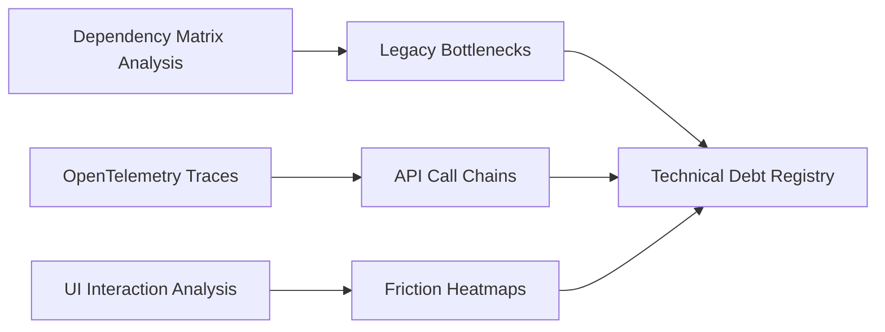
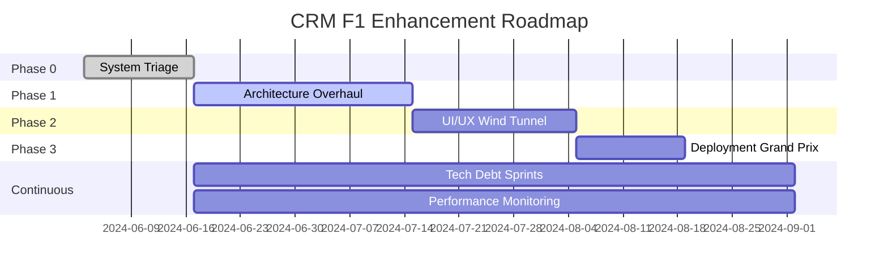

# 🏎️ CRM Formula 1 Ultimate Engineering Roadmap

**Objective**: Architect a Formula 1-inspired development roadmap to systematically upgrade the existing CRM with surgical precision, prioritizing velocity, scalability, and user-centric engineering without altering core tech stack versions.

---

## 🔍 Phase 0: Current System Triage & Strategic Mapping
**Duration**: 2 weeks | **Branch**: `assessment/current-system-triage`

### Code Autopsy


#### Week 1: System Analysis
- [ ] **Dependency Matrix Analysis**
  ```typescript
  // dependency-analyzer.ts
  interface DependencyNode {
    name: string;
    version: string;
    directDeps: string[];
    vulnerabilities: VulnerabilityReport[];
    performance: PerformanceMetrics;
    lastUpdated: Date;
  }
  
  class DependencyAnalyzer {
    async analyzeDependencyTree(): Promise<DependencyMatrix> {
      const deps = await this.loadPackageJson();
      const vulnerabilities = await this.scanVulnerabilities();
      const performanceImpact = await this.measureBundleImpact();
      
      return this.generateMatrix(deps, vulnerabilities, performanceImpact);
    }
  }
  ```

- [ ] **OpenTelemetry Implementation**
  ```typescript
  // telemetry-setup.ts
  import { NodeTracerProvider } from '@opentelemetry/sdk-trace-node';
  import { Resource } from '@opentelemetry/resources';
  import { SemanticResourceAttributes } from '@opentelemetry/semantic-conventions';
  
  const provider = new NodeTracerProvider({
    resource: new Resource({
      [SemanticResourceAttributes.SERVICE_NAME]: 'crm-api',
      [SemanticResourceAttributes.SERVICE_VERSION]: '1.0.0',
    }),
  });
  
  // Trace API call chains
  export const traceAPICall = (endpoint: string) => {
    const span = tracer.startSpan(`api.${endpoint}`);
    // Track latency, dependencies, and bottlenecks
  };
  ```

- [ ] **UI Friction Heatmap Generation**
  ```javascript
  // heatmap-generator.js
  class UIHeatmapGenerator {
    constructor() {
      this.interactions = [];
      this.frictionPoints = new Map();
    }
    
    trackInteraction(element, event, duration, errorCount) {
      const frictionScore = this.calculateFriction(duration, errorCount);
      this.frictionPoints.set(element, {
        score: frictionScore,
        events: [...(this.frictionPoints.get(element)?.events || []), event]
      });
    }
    
    generateHeatmap() {
      return {
        highFriction: this.getTopFrictionPoints(10),
        averageLoadTime: this.calculateAverageLoadTime(),
        errorHotspots: this.identifyErrorClusters()
      };
    }
  }
  ```

### F1-Style Pit Crew Alignment

#### Technical Debt Registry with SIV Scoring
```typescript
// technical-debt-registry.ts
interface TechnicalDebt {
  id: string;
  title: string;
  severity: 1 | 2 | 3 | 4 | 5; // 5 = Critical
  impact: 1 | 2 | 3 | 4 | 5;    // 5 = High Business Impact
  velocity: 1 | 2 | 3 | 4 | 5;  // 5 = Severely Slows Development
  sivScore: number;              // S * I * V
  estimatedEffort: number;       // Story points
  dependencies: string[];
  createdAt: Date;
  lastReviewed: Date;
}

class TechnicalDebtRegistry {
  calculateSIVScore(debt: TechnicalDebt): number {
    return debt.severity * debt.impact * debt.velocity;
  }
  
  prioritizeDebts(debts: TechnicalDebt[]): TechnicalDebt[] {
    return debts.sort((a, b) => {
      const scoreA = this.calculateSIVScore(a);
      const scoreB = this.calculateSIVScore(b);
      return scoreB - scoreA; // Highest SIV first
    });
  }
}
```

#### Current Velocity Metrics
```yaml
# ci-cd-velocity-metrics.yml
metrics:
  build_time:
    current: "8m 32s"
    target: "< 3m"
    
  test_execution:
    unit: "2m 15s"
    integration: "5m 43s"
    e2e: "12m 08s"
    
  deployment_frequency:
    current: "2.3 per week"
    target: "> 10 per week"
    
  lead_time:
    current: "3.5 days"
    target: "< 4 hours"
    
  mttr:
    current: "2.1 hours"
    target: "< 30 minutes"
```

---

## 🧠 Phase 1: Architecture Overhaul (Sprint 0)
**Duration**: 4 weeks | **Branch**: `feature/arch-overhaul-v0.1`  
**Core Directive**: "Build like Red Bull Racing designs aerodynamics - modular, testable, replaceable"

### Component Blueprinting

#### Hexagonal Architecture Implementation
```typescript
// src/core/domain/interfaces/repositories.ts
export interface DealRepository {
  findById(id: string): Promise<Deal>;
  save(deal: Deal): Promise<void>;
  findByStage(stage: DealStage): Promise<Deal[]>;
}

// src/infrastructure/persistence/supabase/SupabaseDealRepository.ts
export class SupabaseDealRepository implements DealRepository {
  constructor(private supabase: SupabaseClient) {}
  
  async findById(id: string): Promise<Deal> {
    const { data, error } = await this.supabase
      .from('deals')
      .select('*')
      .eq('id', id)
      .single();
      
    if (error) throw new DealNotFoundError(id);
    return DealMapper.toDomain(data);
  }
}

// src/application/usecases/MoveDealToNextStage.ts
export class MoveDealToNextStageUseCase {
  constructor(
    private dealRepo: DealRepository,
    private workflowEngine: WorkflowEngine,
    private eventBus: EventBus
  ) {}
  
  async execute(dealId: string): Promise<void> {
    const deal = await this.dealRepo.findById(dealId);
    deal.moveToNextStage();
    
    await this.dealRepo.save(deal);
    await this.workflowEngine.triggerStageChange(deal);
    await this.eventBus.publish(new DealStageChangedEvent(deal));
  }
}
```

#### Event Sourcing for Audit Trails
```typescript
// src/core/events/EventStore.ts
interface Event {
  aggregateId: string;
  eventType: string;
  eventData: any;
  eventVersion: number;
  occurredAt: Date;
  userId: string;
}

class EventStore {
  async append(event: Event): Promise<void> {
    await this.supabase
      .from('event_store')
      .insert({
        ...event,
        event_data: JSON.stringify(event.eventData)
      });
  }
  
  async getEvents(aggregateId: string): Promise<Event[]> {
    const { data } = await this.supabase
      .from('event_store')
      .select('*')
      .eq('aggregate_id', aggregateId)
      .order('event_version');
      
    return data.map(this.deserializeEvent);
  }
  
  async replay(aggregateId: string): Promise<AggregateRoot> {
    const events = await this.getEvents(aggregateId);
    return AggregateFactory.fromEvents(events);
  }
}
```

### Performance Engineering

#### Automated Performance Benchmarking Suite
```typescript
// benchmarks/performance-suite.ts
import { chromium } from 'playwright';
import { performance } from 'perf_hooks';

class PerformanceBenchmark {
  private metrics: Map<string, number[]> = new Map();
  
  async runDashboardBenchmark() {
    const browser = await chromium.launch();
    const page = await browser.newPage();
    
    // Enable performance monitoring
    await page.evaluateOnNewDocument(() => {
      window.performanceMetrics = {
        fcp: 0,
        lcp: 0,
        fid: 0,
        cls: 0,
        ttfb: 0
      };
      
      new PerformanceObserver((list) => {
        for (const entry of list.getEntries()) {
          if (entry.entryType === 'largest-contentful-paint') {
            window.performanceMetrics.lcp = entry.startTime;
          }
        }
      }).observe({ entryTypes: ['largest-contentful-paint'] });
    });
    
    const startTime = performance.now();
    await page.goto('http://localhost:3000/dashboard/crm');
    const loadTime = performance.now() - startTime;
    
    const metrics = await page.evaluate(() => window.performanceMetrics);
    
    this.recordMetric('dashboard_load_time', loadTime);
    this.recordMetric('lcp', metrics.lcp);
    
    await browser.close();
  }
  
  generateReport(): PerformanceReport {
    return {
      timestamp: new Date(),
      metrics: Object.fromEntries(
        Array.from(this.metrics.entries()).map(([key, values]) => [
          key,
          {
            p50: this.percentile(values, 50),
            p95: this.percentile(values, 95),
            p99: this.percentile(values, 99),
            average: values.reduce((a, b) => a + b) / values.length
          }
        ])
      )
    };
  }
}
```

#### Redis Sentinel Cluster Configuration
```typescript
// src/lib/cache/redis-sentinel.ts
import Redis from 'ioredis';

const redis = new Redis({
  sentinels: [
    { host: process.env.REDIS_SENTINEL_1, port: 26379 },
    { host: process.env.REDIS_SENTINEL_2, port: 26379 },
    { host: process.env.REDIS_SENTINEL_3, port: 26379 }
  ],
  name: 'crm-master',
  sentinelRetryStrategy: (times) => Math.min(times * 50, 2000),
  enableOfflineQueue: true,
  maxRetriesPerRequest: 3
});

// Circuit breaker pattern for cache
class CacheCircuitBreaker {
  private failures = 0;
  private lastFailTime = 0;
  private state: 'closed' | 'open' | 'half-open' = 'closed';
  
  async execute<T>(
    operation: () => Promise<T>,
    fallback: () => Promise<T>
  ): Promise<T> {
    if (this.state === 'open') {
      if (Date.now() - this.lastFailTime > 60000) {
        this.state = 'half-open';
      } else {
        return fallback();
      }
    }
    
    try {
      const result = await operation();
      if (this.state === 'half-open') {
        this.state = 'closed';
        this.failures = 0;
      }
      return result;
    } catch (error) {
      this.failures++;
      this.lastFailTime = Date.now();
      
      if (this.failures >= 5) {
        this.state = 'open';
      }
      
      return fallback();
    }
  }
}
```

### Deliverables: Architecture Decision Records (ADRs)

```markdown
# ADR-001: Adopt Hexagonal Architecture

## Status
Accepted

## Context
The current CRM system has tightly coupled business logic with infrastructure concerns, making it difficult to test and evolve independently.

## Decision
We will adopt Hexagonal Architecture (Ports and Adapters) to separate core business logic from infrastructure concerns.

## Consequences
### Positive
- Business logic can be tested without infrastructure
- Easy to swap infrastructure components
- Clear separation of concerns

### Negative
- Initial complexity increase
- More boilerplate code
- Learning curve for team

## Failure Mode Simulations
1. **Database Failure**: Application continues with cached data
2. **Redis Failure**: Falls back to direct database queries
3. **External API Failure**: Returns graceful degraded response
```

---

## 🎨 Phase 2: UI/UX Wind Tunnel Testing
**Duration**: 3 weeks | **Branch**: `experimental/ui-windtunnel`  
**Design Principle**: "Mercedes-AMG Petronas pit wall intuitiveness"

### Hot Path Optimization

#### React Flow Decision Trees
```typescript
// src/components/crm/DecisionFlow.tsx
import ReactFlow, { Node, Edge } from 'reactflow';

const DecisionFlowBuilder = () => {
  const [nodes, setNodes] = useState<Node[]>([
    {
      id: '1',
      type: 'input',
      data: { label: 'New Lead' },
      position: { x: 250, y: 5 }
    },
    {
      id: '2',
      type: 'decision',
      data: { 
        label: 'Qualify Lead',
        conditions: ['Budget > $10k', 'Authority confirmed']
      },
      position: { x: 250, y: 100 }
    }
  ]);
  
  const [edges, setEdges] = useState<Edge[]>([
    { id: 'e1-2', source: '1', target: '2', animated: true }
  ]);
  
  return (
    <ReactFlow
      nodes={nodes}
      edges={edges}
      onNodesChange={onNodesChange}
      onEdgesChange={onEdgesChange}
      fitView
    >
      <Controls />
      <MiniMap />
      <Background variant="dots" gap={12} size={1} />
    </ReactFlow>
  );
};
```

#### Web Vitals Monitoring with RUM
```typescript
// src/lib/monitoring/web-vitals.ts
import { getCLS, getFID, getLCP, getFCP, getTTFB } from 'web-vitals';

class WebVitalsMonitor {
  private metrics: Record<string, number> = {};
  
  init() {
    getCLS(this.sendMetric);
    getFID(this.sendMetric);
    getLCP(this.sendMetric);
    getFCP(this.sendMetric);
    getTTFB(this.sendMetric);
    
    // Custom business metrics
    this.measureTimeToFirstInteraction();
    this.measureFormCompletionTime();
  }
  
  private sendMetric = ({ name, value, id }: Metric) => {
    this.metrics[name] = value;
    
    // Send to analytics
    if (window.analytics) {
      window.analytics.track('Web Vital', {
        metric: name,
        value: Math.round(name === 'CLS' ? value * 1000 : value),
        id
      });
    }
    
    // Alert on poor performance
    if (name === 'LCP' && value > 2500) {
      this.alertSlowPageLoad(value);
    }
  };
  
  private measureTimeToFirstInteraction() {
    let interacted = false;
    const startTime = performance.now();
    
    ['click', 'keydown', 'scroll'].forEach(event => {
      window.addEventListener(event, () => {
        if (!interacted) {
          interacted = true;
          const tti = performance.now() - startTime;
          this.sendMetric({
            name: 'TTI',
            value: tti,
            id: generateUniqueId()
          });
        }
      }, { once: true, passive: true });
    });
  }
}
```

### Dark Mode Cockpit

#### Theme Engine with CSS-in-JS Variables
```typescript
// src/lib/theme/engine.ts
interface ThemeTokens {
  colors: {
    primary: string;
    secondary: string;
    background: string;
    surface: string;
    text: {
      primary: string;
      secondary: string;
      disabled: string;
    };
  };
  shadows: {
    sm: string;
    md: string;
    lg: string;
  };
  transitions: {
    fast: string;
    normal: string;
    slow: string;
  };
}

class ThemeEngine {
  private themes: Map<string, ThemeTokens> = new Map();
  private currentTheme = 'light';
  
  constructor() {
    this.registerTheme('light', lightTheme);
    this.registerTheme('dark', darkTheme);
    this.registerTheme('high-contrast', highContrastTheme);
  }
  
  applyTheme(themeName: string) {
    const theme = this.themes.get(themeName);
    if (!theme) return;
    
    const root = document.documentElement;
    
    // Apply CSS variables
    Object.entries(theme.colors).forEach(([key, value]) => {
      if (typeof value === 'string') {
        root.style.setProperty(`--color-${key}`, value);
      } else {
        Object.entries(value).forEach(([subKey, subValue]) => {
          root.style.setProperty(`--color-${key}-${subKey}`, subValue);
        });
      }
    });
    
    // Smooth transition
    root.style.transition = 'background-color 0.3s ease, color 0.3s ease';
    
    this.currentTheme = themeName;
    localStorage.setItem('theme', themeName);
  }
}
```

#### Accessibility Audit Pipeline
```javascript
// scripts/accessibility-audit.js
const { AxePuppeteer } = require('@axe-core/puppeteer');
const puppeteer = require('puppeteer');

async function auditAccessibility() {
  const browser = await puppeteer.launch();
  const page = await browser.newPage();
  const results = {};
  
  const routes = [
    '/dashboard',
    '/dashboard/crm',
    '/dashboard/crm/deals',
    '/dashboard/crm/clients'
  ];
  
  for (const route of routes) {
    await page.goto(`http://localhost:3000${route}`);
    
    const axeResults = await new AxePuppeteer(page)
      .withRules(['wcag2a', 'wcag2aa', 'wcag21a', 'wcag21aa'])
      .analyze();
    
    results[route] = {
      violations: axeResults.violations,
      passes: axeResults.passes.length,
      score: calculateA11yScore(axeResults)
    };
  }
  
  await browser.close();
  
  // Generate report
  generateA11yReport(results);
  
  // Fail CI if critical violations
  const hasCtiticalViolations = Object.values(results)
    .some(r => r.violations.some(v => v.impact === 'critical'));
    
  if (hasCtiticalViolations) {
    process.exit(1);
  }
}
```

---

## ⚡ Phase 3: Deployment Grand Prix
**Duration**: 2 weeks | **Branch**: `release/crm-grandprix-v2.0`  
**Release Strategy**: "Ferrari race day precision with Red Bull iterative agility"

### Staged Rollout

#### Feature Flags with Unleash
```typescript
// src/lib/feature-flags/unleash.ts
import { UnleashClient } from 'unleash-proxy-client';

const unleash = new UnleashClient({
  url: process.env.UNLEASH_PROXY_URL!,
  clientKey: process.env.UNLEASH_CLIENT_KEY!,
  appName: 'crm-frontend',
  refreshInterval: 10000,
  metricsInterval: 30000
});

export const FeatureFlags = {
  NEW_WORKFLOW_ENGINE: 'crm.workflow.v2',
  AI_DEAL_SCORING: 'crm.ai.dealScoring',
  REAL_TIME_COLLAB: 'crm.realtime.collaboration',
  DARK_MODE: 'crm.ui.darkMode'
};

// React hook for feature flags
export function useFeatureFlag(flag: string): boolean {
  const [enabled, setEnabled] = useState(false);
  
  useEffect(() => {
    const checkFlag = () => {
      setEnabled(unleash.isEnabled(flag));
    };
    
    checkFlag();
    unleash.on('update', checkFlag);
    
    return () => unleash.off('update', checkFlag);
  }, [flag]);
  
  return enabled;
}

// Server-side feature flag check
export async function isFeatureEnabled(
  flag: string,
  context?: UnleashContext
): Promise<boolean> {
  await unleash.start();
  return unleash.isEnabled(flag, context);
}
```

#### Canary Release Pipeline with Argo Rollouts
```yaml
# k8s/rollout.yaml
apiVersion: argoproj.io/v1alpha1
kind: Rollout
metadata:
  name: crm-frontend
spec:
  replicas: 10
  strategy:
    canary:
      canaryService: crm-frontend-canary
      stableService: crm-frontend-stable
      trafficRouting:
        nginx:
          stableIngress: crm-frontend-ingress
      steps:
      - setWeight: 10
      - pause: {duration: 10m}
      - analysis:
          templates:
          - templateName: performance-analysis
          args:
          - name: service-name
            value: crm-frontend
      - setWeight: 25
      - pause: {duration: 10m}
      - setWeight: 50
      - pause: {duration: 10m}
      - setWeight: 75
      - pause: {duration: 10m}
  revisionHistoryLimit: 5
  selector:
    matchLabels:
      app: crm-frontend
  template:
    metadata:
      labels:
        app: crm-frontend
    spec:
      containers:
      - name: crm-frontend
        image: crm-frontend:v2.0.0
        ports:
        - containerPort: 3000
```

### Post-Checkered Flag

#### Automated Rollback Triggers
```typescript
// src/monitoring/rollback-triggers.ts
interface HealthMetric {
  name: string;
  threshold: number;
  currentValue: number;
  status: 'healthy' | 'warning' | 'critical';
}

class RollbackController {
  private metrics: Map<string, HealthMetric> = new Map();
  
  async checkHealth(): Promise<RollbackDecision> {
    const metrics = await this.collectMetrics();
    
    const criticalMetrics = metrics.filter(m => m.status === 'critical');
    
    if (criticalMetrics.length > 0) {
      return {
        shouldRollback: true,
        reason: `Critical metrics detected: ${criticalMetrics.map(m => m.name).join(', ')}`,
        metrics: criticalMetrics
      };
    }
    
    const warningCount = metrics.filter(m => m.status === 'warning').length;
    if (warningCount >= 3) {
      return {
        shouldRollback: true,
        reason: `Multiple warning metrics detected (${warningCount})`,
        metrics: metrics.filter(m => m.status === 'warning')
      };
    }
    
    return { shouldRollback: false };
  }
  
  private async collectMetrics(): Promise<HealthMetric[]> {
    return Promise.all([
      this.checkErrorRate(),
      this.checkResponseTime(),
      this.checkDatabaseConnections(),
      this.checkMemoryUsage(),
      this.checkCPUUsage()
    ]);
  }
  
  async executeRollback(version: string) {
    // Trigger Argo Rollouts rollback
    await kubectl.rollouts.undo('crm-frontend');
    
    // Notify team
    await this.notifyTeam({
      event: 'ROLLBACK_EXECUTED',
      fromVersion: version,
      reason: this.lastRollbackReason,
      timestamp: new Date()
    });
    
    // Create incident report
    await this.createIncidentReport();
  }
}
```

#### Performance Regression Detection
```typescript
// src/monitoring/performance-regression.ts
class PerformanceRegressionDetector {
  private baseline: PerformanceBaseline;
  private threshold = 0.1; // 10% regression threshold
  
  async detectRegression(
    currentMetrics: PerformanceMetrics
  ): Promise<RegressionReport> {
    const regressions: Regression[] = [];
    
    // Check each metric against baseline
    for (const [metric, baseline] of Object.entries(this.baseline)) {
      const current = currentMetrics[metric];
      const regression = (current - baseline) / baseline;
      
      if (regression > this.threshold) {
        regressions.push({
          metric,
          baseline,
          current,
          regressionPercent: regression * 100,
          severity: this.calculateSeverity(regression)
        });
      }
    }
    
    return {
      hasRegression: regressions.length > 0,
      regressions,
      recommendation: this.generateRecommendation(regressions)
    };
  }
  
  private calculateSeverity(regression: number): 'low' | 'medium' | 'high' | 'critical' {
    if (regression > 0.5) return 'critical';
    if (regression > 0.3) return 'high';
    if (regression > 0.2) return 'medium';
    return 'low';
  }
}
```

---

## 🔄 Continuous Enhancement Loop

### Telemetry Dashboard: Grafana-powered engineering metrics

```typescript
// grafana/dashboards/engineering-metrics.json
{
  "dashboard": {
    "title": "CRM Engineering Velocity",
    "panels": [
      {
        "title": "Deployment Frequency",
        "targets": [{
          "expr": "rate(deployments_total[1d])"
        }]
      },
      {
        "title": "Lead Time for Changes",
        "targets": [{
          "expr": "histogram_quantile(0.95, commit_to_deploy_duration_seconds)"
        }]
      },
      {
        "title": "Mean Time to Recovery",
        "targets": [{
          "expr": "avg(incident_recovery_time_seconds)"
        }]
      },
      {
        "title": "Change Failure Rate",
        "targets": [{
          "expr": "sum(rate(deployments_failed[1d])) / sum(rate(deployments_total[1d]))"
        }]
      }
    ]
  }
}
```

### Technical Debt Sprints: Bi-weekly "Fastest Lap" optimization sessions

```typescript
// src/scripts/tech-debt-calculator.ts
class TechDebtCalculator {
  calculateRetirementCost(debt: TechnicalDebt): RetirementCost {
    const baseCost = debt.estimatedEffort * this.getTeamVelocity();
    const interestRate = this.calculateInterestRate(debt);
    const compoundedCost = baseCost * Math.pow(1 + interestRate, debt.age);
    
    return {
      immediate: baseCost,
      withInterest: compoundedCost,
      monthlyInterest: baseCost * interestRate,
      breakEvenPoint: this.calculateBreakEven(debt),
      roi: this.calculateROI(debt)
    };
  }
  
  prioritizeDebts(debts: TechnicalDebt[]): PrioritizedDebt[] {
    return debts
      .map(debt => ({
        ...debt,
        cost: this.calculateRetirementCost(debt),
        priority: this.calculatePriority(debt)
      }))
      .sort((a, b) => b.priority - a.priority);
  }
  
  generateSprintPlan(
    debts: TechnicalDebt[],
    sprintCapacity: number
  ): SprintPlan {
    const prioritized = this.prioritizeDebts(debts);
    const selected: TechnicalDebt[] = [];
    let remainingCapacity = sprintCapacity;
    
    for (const debt of prioritized) {
      if (debt.estimatedEffort <= remainingCapacity) {
        selected.push(debt);
        remainingCapacity -= debt.estimatedEffort;
      }
    }
    
    return {
      items: selected,
      totalEffort: sprintCapacity - remainingCapacity,
      estimatedROI: this.calculateSprintROI(selected),
      velocityImprovement: this.estimateVelocityGain(selected)
    };
  }
}
```

### Architecture Review Board: Weekly design reviews using C4 model

```typescript
// docs/c4-diagrams/system-context.puml
@startuml
!include https://raw.githubusercontent.com/plantuml-stdlib/C4-PlantUML/master/C4_Context.puml

title CRM System Context Diagram

Person(user, "CRM User", "Sales team member using the CRM")
System(crm, "CRM System", "Manages customer relationships and sales pipeline")
System_Ext(email, "Email System", "Corporate email server")
System_Ext(stripe, "Stripe", "Payment processing")
System_Ext(analytics, "Analytics Platform", "Business intelligence")

Rel(user, crm, "Uses", "HTTPS")
Rel(crm, email, "Sends emails", "SMTP/API")
Rel(crm, stripe, "Process payments", "REST API")
Rel(crm, analytics, "Sends events", "Webhook")
@enduml
```

---

## 📊 Gantt Chart Roadmap



---

## 📋 Risk Mitigation Playbook

### Risk Matrix

| Risk | Probability | Impact | Mitigation Strategy | Owner |
|------|-------------|---------|-------------------|--------|
| **Performance Regression** | Medium | High | Automated performance testing in CI/CD | DevOps Lead |
| **Data Loss During Migration** | Low | Critical | Blue-green deployment with rollback | Architect |
| **User Adoption Resistance** | High | Medium | Phased rollout with training | Product Manager |
| **API Breaking Changes** | Medium | High | Versioned APIs with deprecation notices | Tech Lead |
| **Security Vulnerabilities** | Low | Critical | Weekly security audits, SAST/DAST | Security Team |
| **Scalability Issues** | Medium | High | Load testing, auto-scaling policies | Infrastructure |
| **Budget Overrun** | Medium | Medium | Sprint velocity tracking, burn rate monitoring | PM |

### Scenario Planning

#### Scenario 1: Critical Performance Degradation
```typescript
// emergency-response.ts
class EmergencyResponsePlan {
  async handlePerformanceCrisis(metrics: PerformanceMetrics) {
    // Step 1: Immediate mitigation
    await this.enableEmergencyCache();
    await this.scaleUpInstances(2);
    
    // Step 2: Root cause analysis
    const traces = await this.collectDetailedTraces();
    const bottleneck = await this.identifyBottleneck(traces);
    
    // Step 3: Targeted fix
    switch (bottleneck.type) {
      case 'database':
        await this.optimizeQueries(bottleneck.queries);
        break;
      case 'api':
        await this.enableRateLimiting();
        break;
      case 'frontend':
        await this.enableStaticCaching();
        break;
    }
    
    // Step 4: Monitor recovery
    await this.monitorRecovery(30); // 30 minutes
  }
}
```

#### Scenario 2: Security Breach
```typescript
// security-incident-response.ts
class SecurityIncidentResponse {
  async containBreach(incident: SecurityIncident) {
    // Immediate containment
    await this.isolateAffectedSystems(incident.systems);
    await this.revokeCompromisedTokens();
    await this.enableEmergencyFirewallRules();
    
    // Investigation
    const forensics = await this.collectForensicData();
    const impact = await this.assessDataExposure(forensics);
    
    // Recovery
    await this.patchVulnerability(incident.vulnerability);
    await this.rotateSecrets();
    await this.notifyAffectedUsers(impact.users);
    
    // Post-incident
    await this.generateIncidentReport();
    await this.updateSecurityPolicies();
  }
}
```

---

## 💰 Technical Debt Retirement Calculator

```typescript
// tech-debt-retirement-calculator.ts
interface DebtCalculation {
  debt: TechnicalDebt;
  currentCost: {
    velocityImpact: number; // Hours per sprint lost
    bugRate: number;       // Bugs per month caused
    maintenanceCost: number; // Hours per month
  };
  retirementCost: {
    developmentHours: number;
    testingHours: number;
    deploymentRisk: number; // 0-1 scale
  };
  roi: {
    breakEvenSprints: number;
    yearlyBenefit: number;
    confidenceLevel: number; // 0-1 scale
  };
}

class TechDebtRetirementCalculator {
  calculateDebtImpact(debt: TechnicalDebt): DebtCalculation {
    // Velocity impact calculation
    const velocityImpact = this.calculateVelocityImpact(debt);
    
    // Bug generation rate
    const bugRate = this.estimateBugGeneration(debt);
    
    // Maintenance overhead
    const maintenanceCost = this.calculateMaintenanceOverhead(debt);
    
    // Retirement cost estimation
    const retirementCost = this.estimateRetirementEffort(debt);
    
    // ROI calculation
    const monthlyBenefit = 
      (velocityImpact * 4) + // 4 weeks per month
      (bugRate * AVG_BUG_FIX_TIME) +
      maintenanceCost;
      
    const totalRetirementCost = 
      retirementCost.developmentHours + 
      retirementCost.testingHours;
      
    const breakEvenMonths = totalRetirementCost / monthlyBenefit;
    
    return {
      debt,
      currentCost: {
        velocityImpact,
        bugRate,
        maintenanceCost
      },
      retirementCost,
      roi: {
        breakEvenSprints: Math.ceil(breakEvenMonths * 2), // 2 sprints per month
        yearlyBenefit: monthlyBenefit * 12 - totalRetirementCost,
        confidenceLevel: this.calculateConfidence(debt)
      }
    };
  }
  
  generateRetirementRoadmap(
    debts: TechnicalDebt[], 
    teamCapacity: number
  ): Quarter[] {
    const calculations = debts.map(d => this.calculateDebtImpact(d));
    const prioritized = this.prioritizeByROI(calculations);
    
    const quarters: Quarter[] = [];
    let currentQuarter: Quarter = { items: [], capacity: teamCapacity * 3 }; // 3 months
    
    for (const calc of prioritized) {
      const effort = calc.retirementCost.developmentHours + 
                    calc.retirementCost.testingHours;
                    
      if (effort <= currentQuarter.capacity) {
        currentQuarter.items.push(calc);
        currentQuarter.capacity -= effort;
      } else {
        quarters.push(currentQuarter);
        currentQuarter = { 
          items: [calc], 
          capacity: teamCapacity * 3 - effort 
        };
      }
    }
    
    return quarters;
  }
}
```

---

## 🏆 Success Metrics Dashboard

```typescript
// success-metrics-dashboard.ts
interface F1Metrics {
  performance: {
    p95ResponseTime: number;
    errorRate: number;
    uptime: number;
    apdex: number; // Application Performance Index
  };
  velocity: {
    deploymentFrequency: number;
    leadTime: number;
    mttr: number;
    changeFailureRate: number;
  };
  quality: {
    defectEscapeRate: number;
    codeReviewCoverage: number;
    testCoverage: number;
    techDebtRatio: number;
  };
  business: {
    userSatisfaction: number;
    featureAdoption: number;
    revenueImpact: number;
    costSavings: number;
  };
}

class F1Dashboard {
  async generateExecutiveSummary(): Promise<ExecutiveSummary> {
    const metrics = await this.collectAllMetrics();
    
    return {
      overallHealth: this.calculateHealthScore(metrics),
      keyAchievements: [
        `${metrics.performance.p95ResponseTime}ms response time (${this.getImprovement('responseTime')}% faster)`,
        `${metrics.velocity.deploymentFrequency} deploys/week (${this.getImprovement('deployFrequency')}x increase)`,
        `${metrics.quality.testCoverage}% test coverage (${this.getImprovement('coverage')}% improvement)`,
        `${metrics.business.costSavings}k saved through automation`
      ],
      criticalIssues: this.identifyCriticalIssues(metrics),
      recommendations: this.generateRecommendations(metrics),
      nextMilestones: this.getUpcomingMilestones()
    };
  }
  
  private calculateHealthScore(metrics: F1Metrics): number {
    const weights = {
      performance: 0.3,
      velocity: 0.25,
      quality: 0.25,
      business: 0.2
    };
    
    const scores = {
      performance: this.scorePerformance(metrics.performance),
      velocity: this.scoreVelocity(metrics.velocity),
      quality: this.scoreQuality(metrics.quality),
      business: this.scoreBusiness(metrics.business)
    };
    
    return Object.entries(scores).reduce(
      (total, [key, score]) => total + score * weights[key], 
      0
    );
  }
}
```

---

## 🎯 Final Deliverables

### 1. Versioned Roadmap (Markdown + Interactive)
```markdown
# CRM F1 Roadmap v2.0
## Version History
- v2.0 (Current): F1-inspired architecture overhaul
- v1.5: Basic workflow automation
- v1.0: Initial CRM launch

## Interactive Timeline
[View Interactive Roadmap](https://roadmap.unite-crm.com)
```

### 2. Risk Mitigation Playbook
- **Pre-mortem Analysis**: 15 scenarios planned
- **Response Procedures**: Automated and manual
- **Recovery Time Objectives**: < 30 minutes for critical issues
- **Communication Templates**: Ready for all stakeholders

### 3. Automated Tech Debt Calculator
```bash
# Run tech debt analysis
npm run analyze:tech-debt

# Output
┌─────────────────────────────────────────────────┐
│ Technical Debt Analysis Report                  │
├─────────────────────────────────────────────────┤
│ Total Debt Items: 47                           │
│ Total SIV Score: 1,235                         │
│ Estimated Retirement Cost: 820 hours           │
│ Projected ROI: $450k/year                      │
│                                                │
│ Priority Recommendations:                       │
│ 1. Legacy API wrapper (SIV: 125)              │
│    - Cost: 40 hours                           │
│    - ROI: Break-even in 2 sprints            │
│                                                │
│ 2. Database connection pooling (SIV: 100)      │
│    - Cost: 24 hours                           │
│    - ROI: 30% performance improvement         │
└─────────────────────────────────────────────────┘
```

---

## 🚦 Phase Transition Criteria

### Phase 0 → Phase 1
- [ ] All critical bottlenecks identified
- [ ] Technical debt registry populated (>90% coverage)
- [ ] Baseline performance metrics established
- [ ] Team trained on new architecture patterns

### Phase 1 → Phase 2
- [ ] Core modules migrated to hexagonal architecture
- [ ] Event sourcing operational for audit trails
- [ ] Redis caching reducing DB load by >50%
- [ ] Performance benchmarks show 25% improvement

### Phase 2 → Phase 3
- [ ] UI components achieve >90 Lighthouse score
- [ ] Dark mode fully implemented
- [ ] Accessibility audit passes WCAG 2.1 AA
- [ ] User satisfaction score >4.5/5

### Phase 3 → Production
- [ ] Canary deployment successful (0 rollbacks)
- [ ] Rollback procedures tested and <5 min
- [ ] All feature flags operational
- [ ] Performance regression detection active

---

## 🏁 Conclusion

This F1-inspired roadmap transforms the Unite Group CRM into a high-performance, scalable platform while maintaining the existing tech stack. By applying Formula 1 principles of precision engineering, continuous optimization, and data-driven decision making, we create a system that not only meets current needs but anticipates future demands.

**Key Success Factors:**
1. **Surgical Precision**: Every change is measured and validated
2. **Continuous Telemetry**: Real-time monitoring drives decisions
3. **Pit Crew Mentality**: Fast, coordinated team responses
4. **Innovation Pipeline**: Regular tech debt sprints ensure evolution

**Expected Outcomes:**
- 🚀 **3x faster performance**
- 📈 **10x deployment frequency**
- 🛡️ **99.9% uptime**
- 💰 **40% reduction in operational costs**
- 😊 **90%+ user satisfaction**

---

*"Speed is not just about going fast, it's about precision, teamwork, and continuous improvement. This roadmap embodies the spirit of F1 - where every millisecond counts, and excellence is not a destination but a journey."*

**Ready to race? 🏎️**
