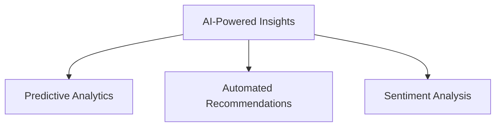
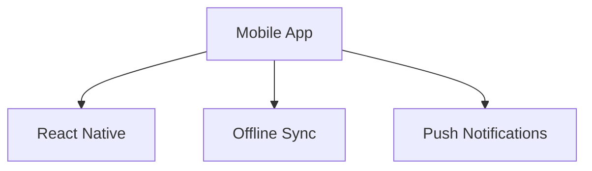
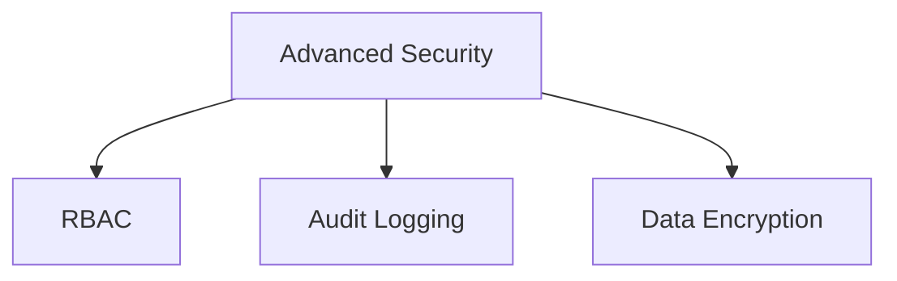
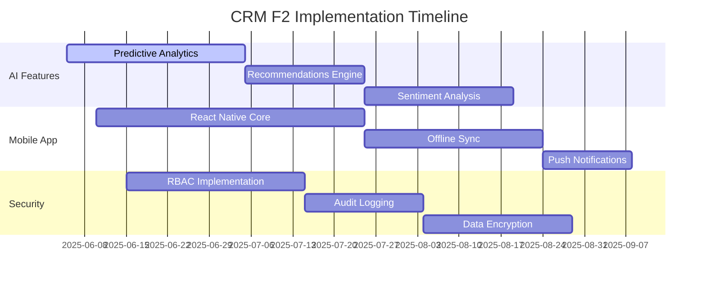

# CRM F2 Next Phase Roadmap

## AI-Powered Insights

### Predictive Analytics
- Implement ML models for deal success prediction
- Create churn risk assessment for clients
- Develop revenue forecasting tools

### Automated Recommendations
- Task prioritization based on deal value
- Client engagement suggestions
- Cross-sell/upsell opportunity identification

### Sentiment Analysis
- Analyze email/communication tone
- Detect client satisfaction levels
- Flag at-risk relationships

## Mobile App Development

### React Native Implementation
- Unified codebase for iOS/Android
- CRM feature parity
- Mobile-optimized UI

### Offline Synchronization
- Local data caching
- Conflict resolution
- Background sync

### Push Notifications
- Deal milestone alerts
- Task reminders
- Team collaboration pings

## Advanced Security

### Role-Based Access Control
- Granular permissions
- Department-specific views
- Custom permission sets

### Audit Logging
- User activity tracking
- Data change history
- Compliance reports

### Data Encryption
- AES-256 at rest encryption
- TLS 1.3 in transit
- Key rotation automation

## Implementation Timeline

## Resource Allocation
| Team          | AI Features | Mobile App | Security |
|---------------|-------------|------------|----------|
| Backend       | 3           | 2          | 2        |
| Frontend      | 1           | 4          | 1        |
| Data Science  | 4           | -          | -        |
| DevOps        | 1           | 2          | 3        |

## Success Metrics
1. 30% increase in deal conversion rate
2. 25% reduction in client churn
3. 40% faster mobile task completion
4. 99.9% security compliance score
