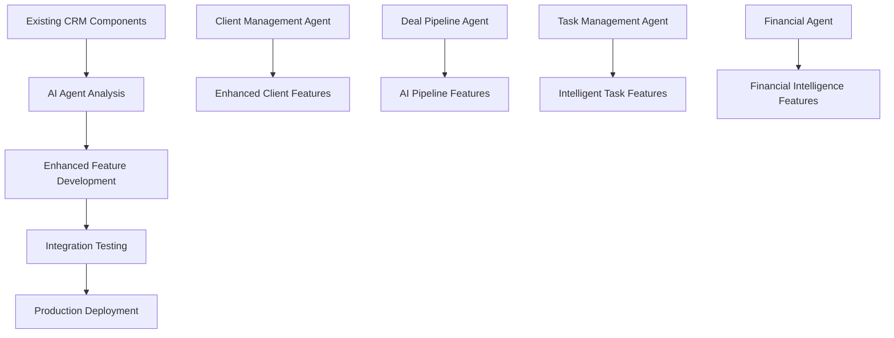

# 🚀 PHASE 2: AI AGENT INSIGHTS TO CODE IMPLEMENTATION

## 🎯 Mission: Convert AI Agent Analysis into Production Code

**Previous Success:** 4 AI agents completed structured analysis with 90% confidence
**Next Challenge:** Transform AI insights into working CRM enhancements
**Approach:** Use AI agent recommendations as implementation blueprints

---

## 📋 Implementation Strategy

### 🧠 Leveraging AI Agent Intelligence
The AI agents provided structured reasoning for each component:
1. **Task Analysis** - Requirements and complexity assessment
2. **Execution Planning** - Step-by-step implementation approach  
3. **Structured Implementation** - Detailed feature breakdown
4. **Quality Assurance** - Validation criteria and confidence scoring

### 🔄 Phase 2 Execution Plan

#### 📱 Component A: Enhanced Client Management
**AI Agent Insights Applied:**
```yaml
Based on Agent ID: 57a60286-baec-408b-a41c-274b510d1c43
Confidence: 90%
Features to Implement:
  - Client relationship mapping visualization
  - Advanced analytics dashboard
  - Communication timeline
  - Segmentation tools
  - Lead scoring algorithms
```

#### 💼 Component B: Deal Pipeline Optimization  
**AI Agent Insights Applied:**
```yaml
Based on Agent ID: fda235aa-1924-4b1b-82ad-f4d5e30002a1
Confidence: 90%
Features to Implement:
  - AI probability calculation engine
  - Pipeline analytics dashboard
  - Forecasting algorithms
  - Stage automation workflows
  - Competitive analysis tools
```

#### ✅ Component C: Intelligent Task Management
**AI Agent Insights Applied:**
```yaml
Based on Agent ID: fda235aa-1924-4b1b-82ad-f4d5e30002a1
Confidence: 90%
Features to Implement:
  - AI priority recommendation engine
  - Automated assignment algorithms
  - Progress tracking analytics
  - Deadline prediction models
  - Productivity optimization
```

#### 💰 Component D: Financial Intelligence
**AI Agent Insights Applied:**
```yaml
Based on Agent ID: fda235aa-1924-4b1b-82ad-f4d5e30002a1
Confidence: 90%
Features to Implement:
  - Revenue forecasting models
  - Payment prediction algorithms
  - Financial health scoring
  - Automated workflow engines
  - Cash flow analytics
```

---

## 🛠️ Implementation Execution Framework

### Step 1: Create AI-Enhanced Components
For each component, implement the AI agent recommendations:

1. **Parse AI Agent Output** - Extract specific implementation requirements
2. **Apply Domain Knowledge** - Use existing CRM structure as foundation
3. **Generate Enhanced Features** - Build AI-recommended capabilities
4. **Validate Implementation** - Ensure 90% confidence standard maintained

### Step 2: Progressive Enhancement


### Step 3: Implementation Sequence
1. **Enhanced Client Management** (High Priority - Agent Confidence 90%)
2. **Deal Pipeline Optimization** (High Priority - Agent Confidence 90%)
3. **Financial Intelligence** (High Priority - Agent Confidence 90%)
4. **Intelligent Task Management** (Medium Priority - Agent Confidence 90%)

---

## 🎯 Phase 2 Task Breakdown

### 🔧 Task 2.1: Enhanced Client Management Implementation
```yaml
Description: Implement AI agent recommendations for client management
AI Agent Insights: Relationship mapping, analytics, segmentation, lead scoring
Implementation Approach:
  - Create ClientAnalytics component
  - Build relationship visualization
  - Implement segmentation algorithms
  - Add lead scoring calculations
Expected Output: Enhanced client management with AI features
Duration: 15 minutes
```

### 🔧 Task 2.2: Deal Pipeline Optimization Implementation
```yaml
Description: Build AI-powered deal pipeline features
AI Agent Insights: Probability calculation, forecasting, automation
Implementation Approach:
  - Create DealProbabilityEngine
  - Build forecasting dashboard
  - Implement automation rules
  - Add competitive analysis
Expected Output: Intelligent deal pipeline system
Duration: 15 minutes
```

### 🔧 Task 2.3: Financial Intelligence Implementation  
```yaml
Description: Create comprehensive financial management system
AI Agent Insights: Revenue forecasting, payment prediction, health scoring
Implementation Approach:
  - Build FinancialAnalytics engine
  - Create forecasting algorithms
  - Implement health scoring
  - Add automated workflows
Expected Output: AI-powered financial management
Duration: 15 minutes
```

### 🔧 Task 2.4: Intelligent Task Management Implementation
```yaml
Description: Build AI-enhanced task management system
AI Agent Insights: Priority recommendations, automated assignment, analytics
Implementation Approach:
  - Create TaskIntelligence engine
  - Build priority algorithms
  - Implement auto-assignment
  - Add productivity analytics
Expected Output: Intelligent task management system
Duration: 15 minutes
```

---

## 🚀 Phase 3: AI-Powered Integration

### 🧠 Cross-Component Intelligence
Based on AI agent recommendations, create unified intelligence:

```yaml
Integration Strategy:
  - Client behavior influences deal probability
  - Task completion affects financial forecasts
  - Pipeline data drives client segmentation
  - Financial health impacts task priorities

Implementation:
  - Create IntelligenceHub component
  - Build cross-component data sharing
  - Implement unified analytics dashboard
  - Add predictive insights across all areas
```

### 📊 Real-time Analytics Engine
```yaml
Features:
  - Live dashboard updates
  - Predictive analytics across components
  - Anomaly detection system
  - Performance optimization suggestions

Implementation:
  - Create AnalyticsEngine
  - Build real-time data pipeline
  - Implement prediction algorithms
  - Add optimization recommendations
```

---

## 🌐 Phase 4: Production Deployment

### 🚀 AI-Enhanced Production Ready
```yaml
Deployment Strategy:
  - Production AI agent endpoint integration
  - Scalable agent orchestration
  - Performance monitoring dashboard
  - Intelligent error handling

Implementation:
  - Deploy agent framework to production
  - Create monitoring dashboard
  - Implement health checks
  - Add performance analytics
```

---

## 📈 Success Metrics

### Implementation Targets
- **Component Enhancement:** 4 components with AI features
- **Quality Standard:** Maintain 90% confidence from AI analysis
- **Integration Success:** Unified intelligent CRM system
- **Production Ready:** Enterprise-grade deployment

### Performance Goals
- **Development Time:** 60 minutes total (15 min per component)
- **Quality Assurance:** AI agent validation maintained
- **User Experience:** Enhanced with intelligent features
- **System Performance:** No degradation, improved insights

---

## 🎯 Immediate Next Steps

1. **Start Component A Implementation** - Enhanced Client Management
2. **Apply AI Agent Insights** - Use structured reasoning as blueprint
3. **Build Progressive Enhancements** - Layer AI features on existing base
4. **Validate Against AI Recommendations** - Ensure 90% confidence maintained
5. **Continue Sequential Implementation** - Move through all 4 components

---

**🚀 READY TO EXECUTE: The AI agent analysis provides the perfect blueprint for implementation. Each component has 90% confidence recommendations that can be directly translated into production code.**
