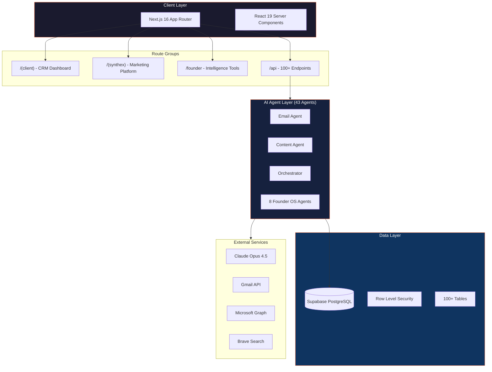
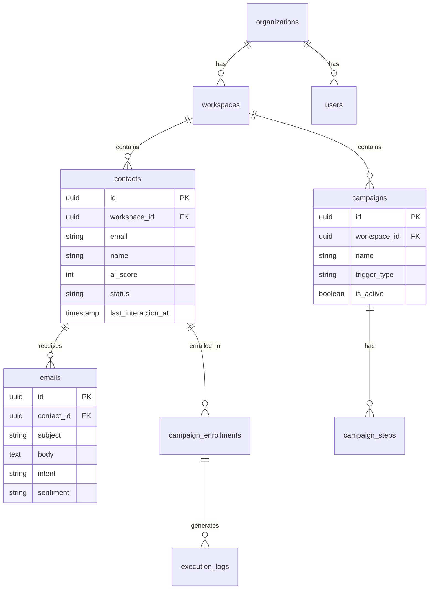

<div align="center">

<!-- Banner Placeholder - Replace with your own -->


# Unite Hub

### AI-Powered Marketing CRM & Automation Platform

[](https://nextjs.org/)
[](https://react.dev/)
[](https://typescriptlang.org/)
[](https://supabase.com/)
[](https://anthropic.com/)

[](/)
[](LICENSE)
[](CONTRIBUTING.md)

**Two Products. One Platform.**

| Unite-Hub | Synthex.social |
|-----------|----------------|
| Core CRM for agencies | White-label AI marketing |
| Email, contacts, campaigns | Small business automation |
| 43 AI agents | Self-service platform |

[Getting Started](#-quick-start) | [Documentation](docs/) | [API Reference](docs/API.md) | [Contributing](CONTRIBUTING.md)

</div>

---

## Architecture



---

## Features

<details>
<summary><strong>AI Intelligence Layer</strong></summary>

| Agent | Description |
|-------|-------------|
| **Email Agent** | Processes emails, extracts intents, analyzes sentiment |
| **Content Generator** | Creates personalized marketing via Claude Opus 4.5 |
| **Contact Intelligence** | AI-powered lead scoring (0-100) |
| **Orchestrator** | Coordinates multi-agent workflows |
| **8 Founder OS Agents** | Strategic advisor, cognitive twin, SEO intelligence |

</details>

<details>
<summary><strong>Email Integration</strong></summary>

- **Gmail OAuth 2.0** - Multi-account support with encrypted token storage
- **Outlook/Microsoft 365** - Full Graph API integration
- **Email Sync** - Auto-import with contact creation
- **Open/Click Tracking** - Pixel-based engagement tracking
- **Calendar Integration** - Read/create events (Outlook)

</details>

<details>
<summary><strong>Drip Campaign Automation</strong></summary>

- **Visual Builder** - Drag-and-drop multi-step sequences
- **Conditional Branching** - If/else based on opens, clicks, replies
- **Trigger Types** - Manual, new contact, tag, score threshold
- **A/B Testing** - Subject line variants
- **Performance Metrics** - Enrollments, completions, open/click rates

</details>

<details>
<summary><strong>Lead Scoring Algorithm</strong></summary>

| Factor | Weight |
|--------|--------|
| Email engagement frequency | 40% |
| Sentiment analysis | 20% |
| Intent quality | 20% |
| Job title/role | 10% |
| Status progression | 10% |

**Score Ranges:** 60-79 = Warm | 80-100 = Hot

</details>

---

## Quick Start

### Prerequisites

- Node.js 20+ (LTS)
- pnpm 9.15+
- Supabase account
- Anthropic API key

### Installation

```bash
# Clone repository
git clone https://github.com/your-org/unite-hub.git
cd unite-hub

# Install dependencies (pnpm required)
pnpm install

# Configure environment
cp .env.example .env.local
# Edit .env.local with your credentials

# Start development server (port 3008)
pnpm dev
```

### Environment Variables

<details>
<summary>Required Variables</summary>

```env
# NextAuth
NEXTAUTH_URL=http://localhost:3008
NEXTAUTH_SECRET=your-secret-key

# Supabase
NEXT_PUBLIC_SUPABASE_URL=https://your-project.supabase.co
NEXT_PUBLIC_SUPABASE_ANON_KEY=your-anon-key
SUPABASE_SERVICE_ROLE_KEY=your-service-role-key

# Claude AI
ANTHROPIC_API_KEY=sk-ant-your-key
```

</details>

<details>
<summary>Optional Variables (Integrations)</summary>

```env
# Gmail OAuth
GOOGLE_CLIENT_ID=your-client-id.apps.googleusercontent.com
GOOGLE_CLIENT_SECRET=your-client-secret

# Outlook/Microsoft 365
MICROSOFT_CLIENT_ID=your-azure-app-client-id
MICROSOFT_CLIENT_SECRET=your-azure-app-client-secret

# Additional Services
BRAVE_API_KEY=your-brave-search-key
OPENROUTER_API_KEY=your-openrouter-key
```

</details>

---

## Development

### Commands

```bash
pnpm dev              # Start dev server (port 3008)
pnpm build            # Production build
pnpm typecheck        # TypeScript validation
pnpm test             # Run 235+ tests
pnpm lint             # ESLint
pnpm integrity:check  # Founder OS health check
```

### Project Structure

```
unite-hub/
├── src/
│   ├── app/           # Next.js App Router
│   │   ├── (client)/  # CRM dashboard routes
│   │   ├── (synthex)/ # Synthex product routes
│   │   ├── founder/   # Founder intelligence
│   │   └── api/       # 100+ API endpoints
│   ├── components/    # React components
│   ├── lib/           # Core utilities
│   │   ├── agents/    # AI agent implementations
│   │   ├── supabase/  # Database clients
│   │   └── anthropic/ # Claude AI integration
│   └── server/        # Server-only code
├── supabase/
│   └── migrations/    # Database migrations
├── docs/              # Documentation
├── scripts/           # CLI automation
└── .claude/           # AI agent configuration
```

---

## API Reference

<details>
<summary><strong>Contacts API</strong></summary>

```typescript
// Create contact
POST /api/contacts
{ workspace_id, email, name, company?, tags? }

// List contacts with filters
GET /api/contacts/list?workspaceId=xxx&status=lead&minScore=60

// Get contact details
GET /api/contacts/[id]?workspaceId=xxx

// Update contact
PATCH /api/contacts/[id]
{ ai_score?, status?, tags? }
```

</details>

<details>
<summary><strong>Campaigns API</strong></summary>

```typescript
// Unified campaign endpoint
POST /api/campaigns/drip
{ action: "create" | "list" | "add_step" | "enroll" | "process_pending" | "metrics" }

// Create campaign
{ action: "create", workspace_id, name, trigger_type, trigger_config }

// Enroll contact
{ action: "enroll", campaign_id, contact_id }

// Get metrics
{ action: "metrics", campaign_id }
```

</details>

<details>
<summary><strong>AI Agents API</strong></summary>

```typescript
// Analyze contact with AI
POST /api/agents/analyze
{ contact_id, workspace_id }

// Generate personalized content
POST /api/agents/generate
{ contact_id, content_type: "followup" | "proposal" | "case_study" }

// Orchestrator workflow
POST /api/agents/orchestrate
{ workflow_type, context }
```

</details>

---

## Database Schema



---

## Deployment

### Vercel (Recommended)

```bash
# Install Vercel CLI
pnpm i -g vercel

# Deploy
vercel

# Set environment variables
vercel env add ANTHROPIC_API_KEY
vercel env add SUPABASE_SERVICE_ROLE_KEY
```

### Docker

```bash
# Build image
docker build -t unite-hub .

# Run container
docker run -p 3008:3008 --env-file .env.local unite-hub
```

---

## Security

- **Multi-tenant isolation** - All queries filter by `workspace_id`
- **Row Level Security** - PostgreSQL RLS on all tables
- **Token encryption** - OAuth tokens encrypted via AES-256-GCM
- **Rate limiting** - API endpoints protected against abuse
- **Audit logging** - All actions logged for compliance

---

## Monitoring

```bash
# Health check
curl http://localhost:3008/api/health

# Database test
curl http://localhost:3008/api/test/db

# Founder OS integrity
pnpm integrity:check
```

---

## Contributing

1. Fork the repository
2. Create feature branch (`git checkout -b feature/amazing`)
3. Commit changes (`git commit -m 'Add amazing feature'`)
4. Push to branch (`git push origin feature/amazing`)
5. Open Pull Request

See [CONTRIBUTING.md](CONTRIBUTING.md) for detailed guidelines.

---

## License

ISC License - see [LICENSE](LICENSE) for details.

---

<div align="center">

**Built with Next.js, Supabase, Claude AI, and TypeScript**

[Documentation](docs/) | [API Reference](docs/API.md) | [Report Bug](issues/new) | [Request Feature](issues/new)

</div>
