# Synthex CLI - Architecture Diagrams

**Version**: 1.0.0
**Last Updated**: 2026-01-15
**Format**: Mermaid diagrams

---

## Table of Contents

1. [System Overview](#system-overview)
2. [Component Architecture](#component-architecture)
3. [Data Flow Diagrams](#data-flow-diagrams)
4. [Integration Architecture](#integration-architecture)
5. [Authentication Flow](#authentication-flow)
6. [Monitoring Architecture](#monitoring-architecture)
7. [Deployment Architecture](#deployment-architecture)

---

## System Overview

### High-Level Architecture

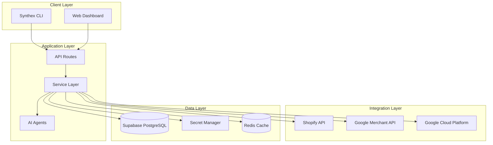

---

## Component Architecture

### Service Layer Components

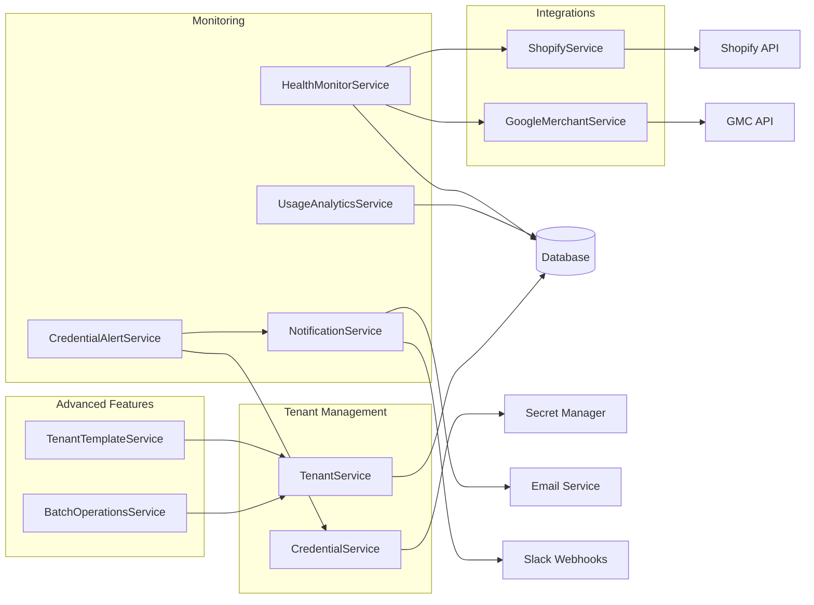

### CLI Command Structure

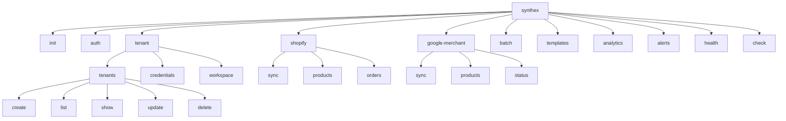

---

## Data Flow Diagrams

### Tenant Creation Flow

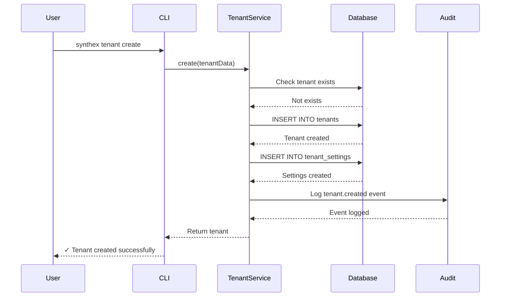

### Shopify Product Sync Flow

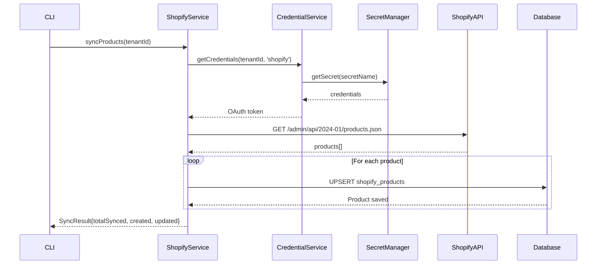

### Credential Expiry Alert Flow

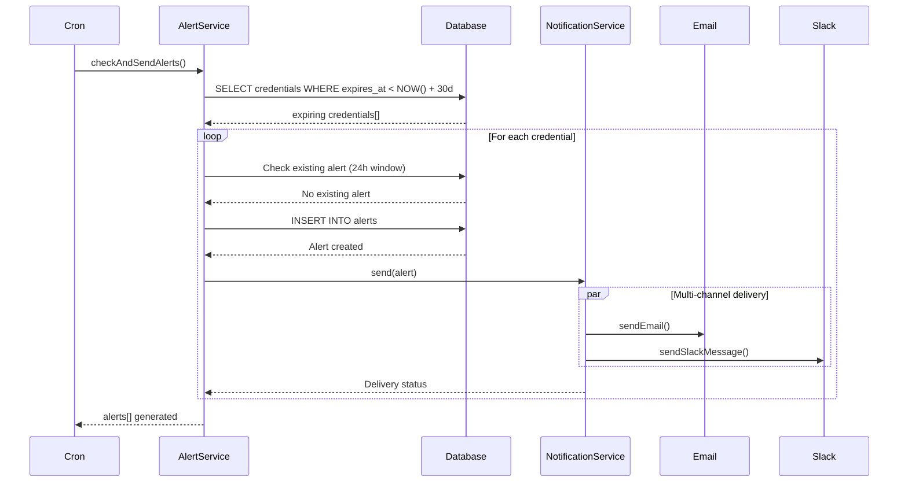

---

## Integration Architecture

### Shopify Integration

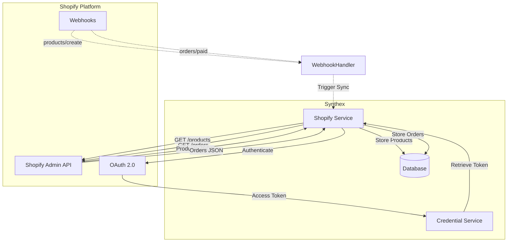

### Google Merchant Center Integration

```mermaid
graph TB
    subgraph "Synthex"
        GMCService[GMC Service]
        DB[(Database)]
        Credentials[Credential Service]
    end

    subgraph "Google Cloud Platform"
        GMCAPI[Content API v2.1]
        OAuth[OAuth 2.0]
        SecretManager[Secret Manager]
    end

    GMCService -->|Authenticate| OAuth
    OAuth -->|Refresh Token| SecretManager
    SecretManager -->|Access Token| Credentials
    Credentials -->|Retrieve Token| GMCService

    GMCService -->|POST /products| GMCAPI
    GMCService -->|GET /products/{id}/status| GMCAPI
    GMCAPI -->|Product Status| GMCService
    GMCAPI -->|Validation Errors| GMCService

    GMCService -->|Store Products| DB
    GMCService -->|Store Feed Status| DB
```

---

## Authentication Flow

### OAuth 2.0 Flow (Shopify & GMC)

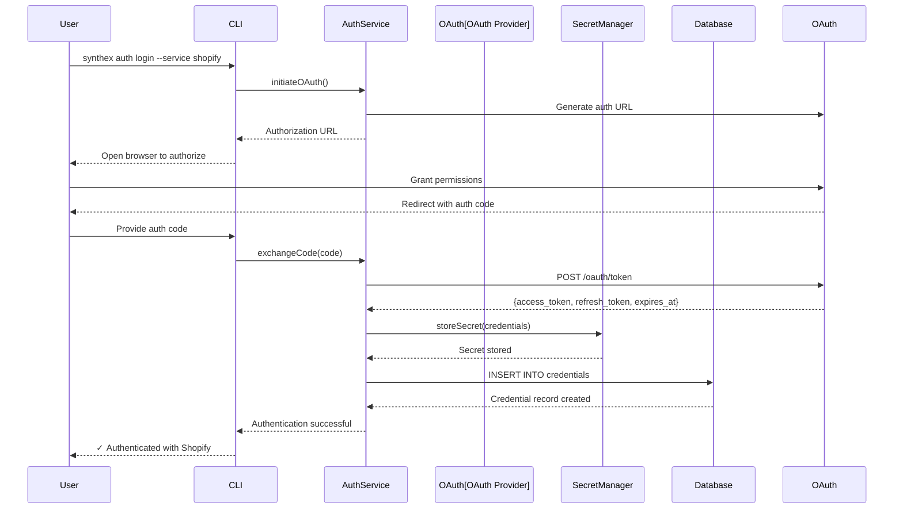

### Session Management

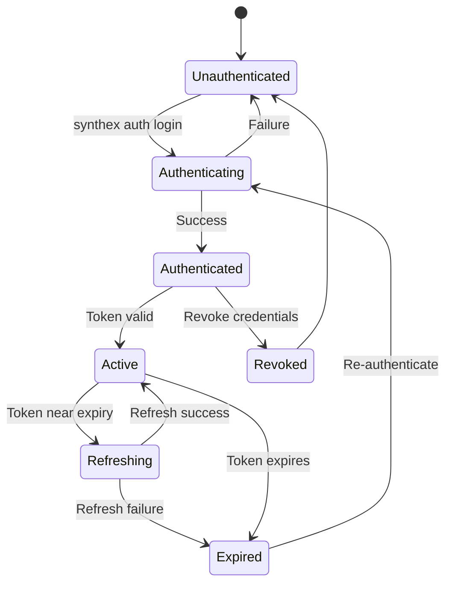

---

## Monitoring Architecture

### Health Check System

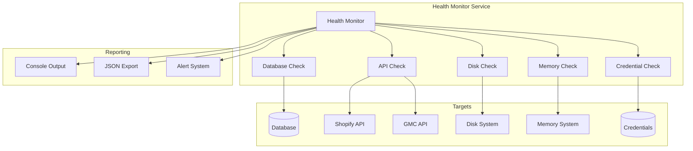

### Alert Pipeline

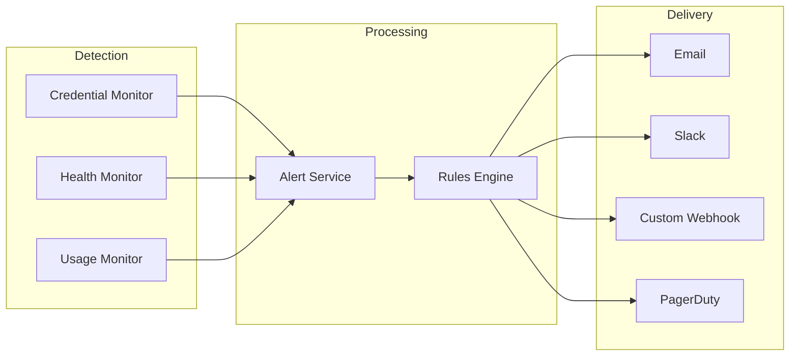

---

## Deployment Architecture

### Production Deployment

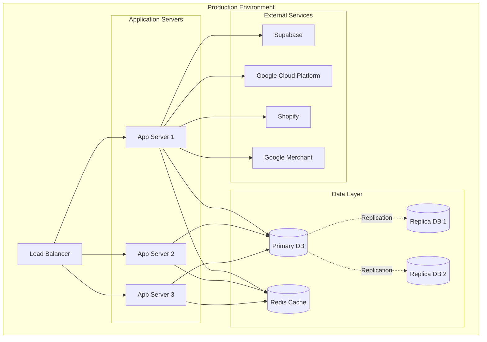

### CI/CD Pipeline

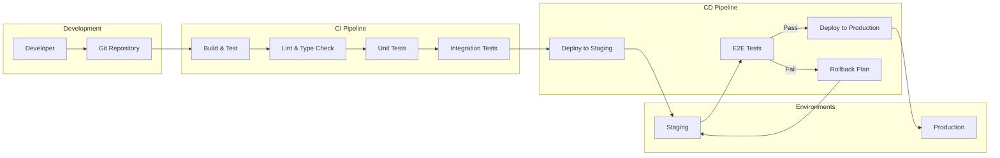

### Multi-Region Architecture

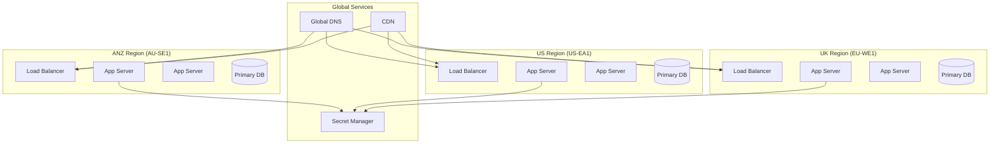

---

## Database Schema Relationships

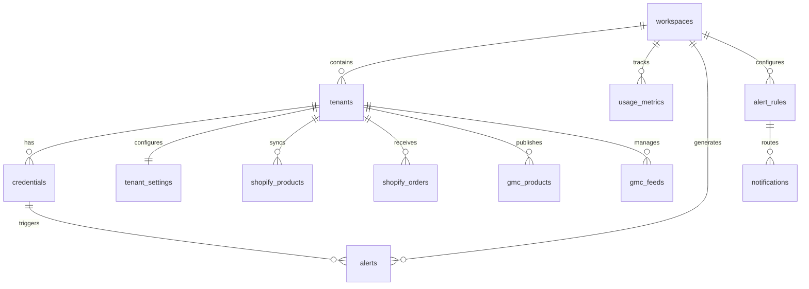

---

## Batch Operations Flow

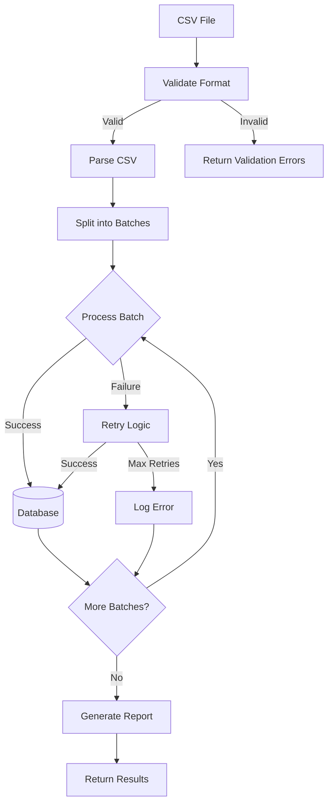

---

**Next Steps**:
- Review [Getting Started Guide](SYNTHEX_GETTING_STARTED.md) for setup instructions
- See [API Reference](SYNTHEX_API_REFERENCE.md) for service APIs
- Check [Database Schema Reference](SYNTHEX_DATABASE_SCHEMA.md) for data models
