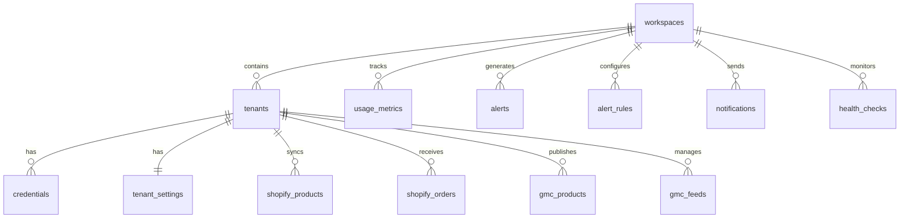

# Synthex CLI - Database Schema Reference

**Version**: 1.0.0
**Last Updated**: 2026-01-15
**Database**: PostgreSQL (Supabase)

---

## Table of Contents

1. [Introduction](#introduction)
2. [Schema Overview](#schema-overview)
3. [Core Tables](#core-tables)
4. [Integration Tables](#integration-tables)
5. [Monitoring Tables](#monitoring-tables)
6. [Relationships](#relationships)
7. [Indexes](#indexes)
8. [RLS Policies](#rls-policies)
9. [Migrations](#migrations)

---

## Introduction

The Synthex Apex Architecture uses a PostgreSQL database managed by Supabase. This document provides complete schema documentation for all tables, relationships, indexes, and security policies.

**Schema**: `public`

**Total Tables**: 15

**Migrations**: 400-406

---

## Schema Overview

```
Core Tables (7)
├── workspaces
├── tenants
├── credentials
├── tenant_settings
├── tenant_metadata
├── workspace_configurations
└── tenant_templates

Integration Tables (4)
├── shopify_products
├── shopify_orders
├── gmc_products
└── gmc_feeds

Monitoring Tables (4)
├── usage_metrics
├── alerts
├── alert_rules
├── notifications
└── health_checks
```

---

## Core Tables

### `workspaces`

Multi-tenant workspaces for organizational isolation.

**Columns**:
| Column | Type | Nullable | Default | Description |
|--------|------|----------|---------|-------------|
| `id` | UUID | NOT NULL | `gen_random_uuid()` | Primary key |
| `name` | TEXT | NOT NULL | - | Workspace display name |
| `market` | TEXT | NOT NULL | - | Market segment (ANZ_SMB, US_SMB, etc.) |
| `region` | TEXT | NOT NULL | - | Geographic region (AU-SE1, US-EA1, etc.) |
| `status` | TEXT | NOT NULL | `'active'` | Workspace status |
| `created_at` | TIMESTAMPTZ | NOT NULL | `NOW()` | Creation timestamp |
| `updated_at` | TIMESTAMPTZ | NOT NULL | `NOW()` | Last update timestamp |

**Constraints**:
```sql
PRIMARY KEY (id)
CHECK (status IN ('active', 'inactive', 'suspended'))
```

**Indexes**:
```sql
CREATE INDEX idx_workspaces_status ON workspaces(status);
CREATE INDEX idx_workspaces_market ON workspaces(market);
```

---

### `tenants`

Individual client tenants within workspaces.

**Columns**:
| Column | Type | Nullable | Default | Description |
|--------|------|----------|---------|-------------|
| `id` | UUID | NOT NULL | `gen_random_uuid()` | Primary key |
| `workspace_id` | UUID | NOT NULL | - | Foreign key to workspaces |
| `tenant_id` | TEXT | NOT NULL | - | Unique tenant identifier |
| `name` | TEXT | NOT NULL | - | Tenant display name |
| `type` | TEXT | NOT NULL | - | Integration type (shopify, google-merchant, mixed) |
| `status` | TEXT | NOT NULL | `'active'` | Tenant status |
| `market` | TEXT | NOT NULL | - | Market segment |
| `region` | TEXT | NOT NULL | - | Geographic region |
| `shopify_shop` | TEXT | NULL | - | Shopify shop domain (e.g., store.myshopify.com) |
| `gmc_merchant_id` | TEXT | NULL | - | Google Merchant Center merchant ID |
| `industry` | TEXT | NULL | - | Business industry |
| `website` | TEXT | NULL | - | Business website URL |
| `contact_email` | TEXT | NULL | - | Primary contact email |
| `created_at` | TIMESTAMPTZ | NOT NULL | `NOW()` | Creation timestamp |
| `updated_at` | TIMESTAMPTZ | NOT NULL | `NOW()` | Last update timestamp |

**Constraints**:
```sql
PRIMARY KEY (id)
FOREIGN KEY (workspace_id) REFERENCES workspaces(id) ON DELETE CASCADE
UNIQUE (workspace_id, tenant_id)
CHECK (type IN ('shopify', 'google-merchant', 'mixed'))
CHECK (status IN ('active', 'inactive', 'suspended'))
CHECK (
  (type = 'shopify' AND shopify_shop IS NOT NULL) OR
  (type = 'google-merchant' AND gmc_merchant_id IS NOT NULL) OR
  (type = 'mixed' AND shopify_shop IS NOT NULL AND gmc_merchant_id IS NOT NULL)
)
```

**Indexes**:
```sql
CREATE INDEX idx_tenants_workspace_id ON tenants(workspace_id);
CREATE INDEX idx_tenants_tenant_id ON tenants(tenant_id);
CREATE INDEX idx_tenants_status ON tenants(status);
CREATE INDEX idx_tenants_type ON tenants(type);
```

---

### `credentials`

Secure credential storage references (actual credentials in Google Secret Manager).

**Columns**:
| Column | Type | Nullable | Default | Description |
|--------|------|----------|---------|-------------|
| `id` | UUID | NOT NULL | `gen_random_uuid()` | Primary key |
| `tenant_id` | TEXT | NOT NULL | - | Foreign key to tenants.tenant_id |
| `service` | TEXT | NOT NULL | - | Service name (shopify, google-merchant) |
| `secret_name` | TEXT | NOT NULL | - | Google Secret Manager secret name |
| `status` | TEXT | NOT NULL | `'valid'` | Credential status |
| `expires_at` | TIMESTAMPTZ | NULL | - | Expiration timestamp |
| `metadata` | JSONB | NOT NULL | `'{}'::jsonb` | Additional metadata |
| `created_at` | TIMESTAMPTZ | NOT NULL | `NOW()` | Creation timestamp |
| `updated_at` | TIMESTAMPTZ | NOT NULL | `NOW()` | Last update timestamp |

**Constraints**:
```sql
PRIMARY KEY (id)
UNIQUE (tenant_id, service)
CHECK (status IN ('valid', 'expired', 'revoked'))
```

**Indexes**:
```sql
CREATE INDEX idx_credentials_tenant_id ON credentials(tenant_id);
CREATE INDEX idx_credentials_service ON credentials(service);
CREATE INDEX idx_credentials_status ON credentials(status);
CREATE INDEX idx_credentials_expires_at ON credentials(expires_at);
```

---

### `tenant_settings`

Tenant-specific configuration settings.

**Columns**:
| Column | Type | Nullable | Default | Description |
|--------|------|----------|---------|-------------|
| `id` | UUID | NOT NULL | `gen_random_uuid()` | Primary key |
| `tenant_id` | TEXT | NOT NULL | - | Foreign key to tenants.tenant_id |
| `settings` | JSONB | NOT NULL | `'{}'::jsonb` | Settings JSON object |
| `created_at` | TIMESTAMPTZ | NOT NULL | `NOW()` | Creation timestamp |
| `updated_at` | TIMESTAMPTZ | NOT NULL | `NOW()` | Last update timestamp |

**Constraints**:
```sql
PRIMARY KEY (id)
UNIQUE (tenant_id)
```

**Example Settings**:
```json
{
  "syncFrequency": "hourly",
  "enableInventorySync": true,
  "enableOrderSync": true,
  "notificationPreferences": {
    "email": true,
    "slack": false
  }
}
```

---

### `tenant_templates`

Pre-configured tenant templates for quick provisioning.

**Columns**:
| Column | Type | Nullable | Default | Description |
|--------|------|----------|---------|-------------|
| `id` | UUID | NOT NULL | `gen_random_uuid()` | Primary key |
| `template_id` | TEXT | NOT NULL | - | Unique template identifier |
| `name` | TEXT | NOT NULL | - | Template display name |
| `description` | TEXT | NULL | - | Template description |
| `type` | TEXT | NOT NULL | - | Tenant type (shopify, google-merchant, mixed) |
| `market` | TEXT | NOT NULL | - | Target market |
| `default_settings` | JSONB | NOT NULL | `'{}'::jsonb` | Default settings for tenants |
| `created_at` | TIMESTAMPTZ | NOT NULL | `NOW()` | Creation timestamp |
| `updated_at` | TIMESTAMPTZ | NOT NULL | `NOW()` | Last update timestamp |

**Constraints**:
```sql
PRIMARY KEY (id)
UNIQUE (template_id)
CHECK (type IN ('shopify', 'google-merchant', 'mixed'))
```

---

## Integration Tables

### `shopify_products`

Synced products from Shopify stores.

**Columns**:
| Column | Type | Nullable | Default | Description |
|--------|------|----------|---------|-------------|
| `id` | UUID | NOT NULL | `gen_random_uuid()` | Primary key |
| `tenant_id` | TEXT | NOT NULL | - | Foreign key to tenants.tenant_id |
| `shopify_product_id` | TEXT | NOT NULL | - | Shopify product ID |
| `title` | TEXT | NOT NULL | - | Product title |
| `description` | TEXT | NULL | - | Product description |
| `vendor` | TEXT | NULL | - | Product vendor/brand |
| `product_type` | TEXT | NULL | - | Product type/category |
| `price` | NUMERIC | NULL | - | Product price |
| `inventory_quantity` | INTEGER | NULL | - | Inventory quantity |
| `sku` | TEXT | NULL | - | Stock keeping unit |
| `image_url` | TEXT | NULL | - | Primary product image URL |
| `raw_data` | JSONB | NOT NULL | `'{}'::jsonb` | Full Shopify product JSON |
| `synced_at` | TIMESTAMPTZ | NOT NULL | `NOW()` | Last sync timestamp |
| `created_at` | TIMESTAMPTZ | NOT NULL | `NOW()` | Creation timestamp |
| `updated_at` | TIMESTAMPTZ | NOT NULL | `NOW()` | Last update timestamp |

**Constraints**:
```sql
PRIMARY KEY (id)
UNIQUE (tenant_id, shopify_product_id)
```

**Indexes**:
```sql
CREATE INDEX idx_shopify_products_tenant_id ON shopify_products(tenant_id);
CREATE INDEX idx_shopify_products_synced_at ON shopify_products(synced_at);
```

---

### `shopify_orders`

Synced orders from Shopify stores.

**Columns**:
| Column | Type | Nullable | Default | Description |
|--------|------|----------|---------|-------------|
| `id` | UUID | NOT NULL | `gen_random_uuid()` | Primary key |
| `tenant_id` | TEXT | NOT NULL | - | Foreign key to tenants.tenant_id |
| `shopify_order_id` | TEXT | NOT NULL | - | Shopify order ID |
| `order_number` | TEXT | NULL | - | Order number (e.g., #1001) |
| `customer_email` | TEXT | NULL | - | Customer email |
| `total_price` | NUMERIC | NULL | - | Total order price |
| `financial_status` | TEXT | NULL | - | Payment status |
| `fulfillment_status` | TEXT | NULL | - | Fulfillment status |
| `created_at_shopify` | TIMESTAMPTZ | NULL | - | Order creation in Shopify |
| `raw_data` | JSONB | NOT NULL | `'{}'::jsonb` | Full Shopify order JSON |
| `synced_at` | TIMESTAMPTZ | NOT NULL | `NOW()` | Last sync timestamp |
| `created_at` | TIMESTAMPTZ | NOT NULL | `NOW()` | Creation timestamp |
| `updated_at` | TIMESTAMPTZ | NOT NULL | `NOW()` | Last update timestamp |

**Constraints**:
```sql
PRIMARY KEY (id)
UNIQUE (tenant_id, shopify_order_id)
```

**Indexes**:
```sql
CREATE INDEX idx_shopify_orders_tenant_id ON shopify_orders(tenant_id);
CREATE INDEX idx_shopify_orders_synced_at ON shopify_orders(synced_at);
```

---

### `gmc_products`

Products in Google Merchant Center.

**Columns**:
| Column | Type | Nullable | Default | Description |
|--------|------|----------|---------|-------------|
| `id` | UUID | NOT NULL | `gen_random_uuid()` | Primary key |
| `tenant_id` | TEXT | NOT NULL | - | Foreign key to tenants.tenant_id |
| `product_id` | TEXT | NOT NULL | - | GMC product ID |
| `title` | TEXT | NOT NULL | - | Product title |
| `description` | TEXT | NULL | - | Product description |
| `link` | TEXT | NULL | - | Product page URL |
| `image_link` | TEXT | NULL | - | Product image URL |
| `price` | TEXT | NULL | - | Price (format: "10.00 AUD") |
| `availability` | TEXT | NULL | - | Stock availability |
| `gtin` | TEXT | NULL | - | Global Trade Item Number |
| `brand` | TEXT | NULL | - | Product brand |
| `status` | TEXT | NULL | - | Product status (active, disapproved, pending) |
| `raw_data` | JSONB | NOT NULL | `'{}'::jsonb` | Full GMC product JSON |
| `synced_at` | TIMESTAMPTZ | NOT NULL | `NOW()` | Last sync timestamp |
| `created_at` | TIMESTAMPTZ | NOT NULL | `NOW()` | Creation timestamp |
| `updated_at` | TIMESTAMPTZ | NOT NULL | `NOW()` | Last update timestamp |

**Constraints**:
```sql
PRIMARY KEY (id)
UNIQUE (tenant_id, product_id)
```

**Indexes**:
```sql
CREATE INDEX idx_gmc_products_tenant_id ON gmc_products(tenant_id);
CREATE INDEX idx_gmc_products_status ON gmc_products(status);
CREATE INDEX idx_gmc_products_synced_at ON gmc_products(synced_at);
```

---

### `gmc_feeds`

Google Merchant Center feed status.

**Columns**:
| Column | Type | Nullable | Default | Description |
|--------|------|----------|---------|-------------|
| `id` | UUID | NOT NULL | `gen_random_uuid()` | Primary key |
| `tenant_id` | TEXT | NOT NULL | - | Foreign key to tenants.tenant_id |
| `feed_id` | TEXT | NOT NULL | - | GMC feed ID |
| `feed_name` | TEXT | NULL | - | Feed display name |
| `status` | TEXT | NULL | - | Feed status |
| `items_total` | INTEGER | NULL | - | Total items in feed |
| `items_approved` | INTEGER | NULL | - | Approved items count |
| `items_disapproved` | INTEGER | NULL | - | Disapproved items count |
| `last_upload_at` | TIMESTAMPTZ | NULL | - | Last successful upload |
| `raw_data` | JSONB | NOT NULL | `'{}'::jsonb` | Full feed status JSON |
| `synced_at` | TIMESTAMPTZ | NOT NULL | `NOW()` | Last sync timestamp |
| `created_at` | TIMESTAMPTZ | NOT NULL | `NOW()` | Creation timestamp |
| `updated_at` | TIMESTAMPTZ | NOT NULL | `NOW()` | Last update timestamp |

**Constraints**:
```sql
PRIMARY KEY (id)
UNIQUE (tenant_id, feed_id)
```

---

## Monitoring Tables

### `usage_metrics`

CLI usage and performance metrics.

**Columns**:
| Column | Type | Nullable | Default | Description |
|--------|------|----------|---------|-------------|
| `id` | UUID | NOT NULL | `gen_random_uuid()` | Primary key |
| `workspace_id` | UUID | NOT NULL | - | Foreign key to workspaces |
| `user_id` | UUID | NULL | - | User who executed (auth.users FK) |
| `metric_type` | TEXT | NOT NULL | - | Metric category |
| `metric_name` | TEXT | NOT NULL | - | Metric name (e.g., "tenant.create") |
| `value` | NUMERIC | NOT NULL | `1` | Metric value |
| `metadata` | JSONB | NOT NULL | `'{}'::jsonb` | Additional metric data |
| `created_at` | TIMESTAMPTZ | NOT NULL | `NOW()` | Metric timestamp |

**Constraints**:
```sql
PRIMARY KEY (id)
FOREIGN KEY (workspace_id) REFERENCES workspaces(id) ON DELETE CASCADE
CHECK (metric_type IN ('command', 'api_call', 'credential_op', 'tenant_op', 'error'))
```

**Indexes**:
```sql
CREATE INDEX idx_usage_metrics_workspace_id ON usage_metrics(workspace_id);
CREATE INDEX idx_usage_metrics_metric_type ON usage_metrics(metric_type);
CREATE INDEX idx_usage_metrics_created_at ON usage_metrics(created_at);
```

---

### `alerts`

Credential expiry and system alerts.

**Columns**:
| Column | Type | Nullable | Default | Description |
|--------|------|----------|---------|-------------|
| `id` | UUID | NOT NULL | `gen_random_uuid()` | Primary key |
| `workspace_id` | UUID | NOT NULL | - | Foreign key to workspaces |
| `tenant_id` | TEXT | NOT NULL | - | Affected tenant |
| `service` | TEXT | NOT NULL | - | Service name |
| `severity` | TEXT | NOT NULL | - | Alert severity |
| `type` | TEXT | NOT NULL | - | Alert type |
| `message` | TEXT | NOT NULL | - | Alert message |
| `expires_at` | TIMESTAMPTZ | NULL | - | Credential expiration |
| `days_until_expiry` | INTEGER | NULL | - | Days until expiration |
| `sent_at` | TIMESTAMPTZ | NOT NULL | `NOW()` | Alert sent timestamp |
| `acknowledged` | BOOLEAN | NOT NULL | `FALSE` | Acknowledgement status |
| `created_at` | TIMESTAMPTZ | NOT NULL | `NOW()` | Creation timestamp |

**Constraints**:
```sql
PRIMARY KEY (id)
FOREIGN KEY (workspace_id) REFERENCES workspaces(id) ON DELETE CASCADE
CHECK (severity IN ('info', 'warning', 'critical'))
CHECK (type IN ('expiring_30d', 'expiring_7d', 'expiring_1d', 'expired'))
```

**Indexes**:
```sql
CREATE INDEX idx_alerts_workspace_id ON alerts(workspace_id);
CREATE INDEX idx_alerts_tenant_id ON alerts(tenant_id);
CREATE INDEX idx_alerts_severity ON alerts(severity);
CREATE INDEX idx_alerts_acknowledged ON alerts(acknowledged);
```

---

### `alert_rules`

Alert routing and notification rules.

**Columns**:
| Column | Type | Nullable | Default | Description |
|--------|------|----------|---------|-------------|
| `id` | UUID | NOT NULL | `gen_random_uuid()` | Primary key |
| `workspace_id` | UUID | NOT NULL | - | Foreign key to workspaces |
| `enabled` | BOOLEAN | NOT NULL | `TRUE` | Rule enabled status |
| `alert_type` | TEXT | NOT NULL | - | Alert type to match |
| `channels` | TEXT[] | NOT NULL | - | Delivery channels array |
| `email_recipients` | TEXT[] | NULL | - | Email addresses |
| `slack_webhook_url` | TEXT | NULL | - | Slack webhook URL |
| `custom_webhook_url` | TEXT | NULL | - | Custom webhook URL |
| `created_at` | TIMESTAMPTZ | NOT NULL | `NOW()` | Creation timestamp |
| `updated_at` | TIMESTAMPTZ | NOT NULL | `NOW()` | Last update timestamp |

**Constraints**:
```sql
PRIMARY KEY (id)
FOREIGN KEY (workspace_id) REFERENCES workspaces(id) ON DELETE CASCADE
CHECK (alert_type IN ('expiring_30d', 'expiring_7d', 'expiring_1d', 'expired'))
```

---

### `notifications`

Notification delivery log.

**Columns**:
| Column | Type | Nullable | Default | Description |
|--------|------|----------|---------|-------------|
| `id` | UUID | NOT NULL | `gen_random_uuid()` | Primary key |
| `workspace_id` | UUID | NOT NULL | - | Foreign key to workspaces |
| `type` | TEXT | NOT NULL | - | Notification type |
| `severity` | TEXT | NOT NULL | - | Notification severity |
| `title` | TEXT | NOT NULL | - | Notification title |
| `message` | TEXT | NOT NULL | - | Notification body |
| `metadata` | JSONB | NOT NULL | `'{}'::jsonb` | Additional data |
| `channels` | TEXT[] | NOT NULL | - | Delivery channels used |
| `delivery_status` | JSONB | NOT NULL | `'{}'::jsonb` | Status per channel |
| `sent_at` | TIMESTAMPTZ | NOT NULL | `NOW()` | Sent timestamp |
| `created_at` | TIMESTAMPTZ | NOT NULL | `NOW()` | Creation timestamp |

**Constraints**:
```sql
PRIMARY KEY (id)
FOREIGN KEY (workspace_id) REFERENCES workspaces(id) ON DELETE CASCADE
CHECK (type IN ('credential_expiry', 'health_alert', 'usage_threshold', 'system_error'))
CHECK (severity IN ('info', 'warning', 'critical'))
```

---

### `health_checks`

System health check results.

**Columns**:
| Column | Type | Nullable | Default | Description |
|--------|------|----------|---------|-------------|
| `id` | UUID | NOT NULL | `gen_random_uuid()` | Primary key |
| `workspace_id` | UUID | NOT NULL | - | Foreign key to workspaces |
| `check_name` | TEXT | NOT NULL | - | Health check name |
| `status` | TEXT | NOT NULL | - | Check status |
| `message` | TEXT | NOT NULL | - | Status message |
| `response_time` | INTEGER | NULL | - | Response time (ms) |
| `metadata` | JSONB | NOT NULL | `'{}'::jsonb` | Additional check data |
| `created_at` | TIMESTAMPTZ | NOT NULL | `NOW()` | Check timestamp |

**Constraints**:
```sql
PRIMARY KEY (id)
FOREIGN KEY (workspace_id) REFERENCES workspaces(id) ON DELETE CASCADE
CHECK (status IN ('healthy', 'degraded', 'unhealthy'))
```

---

## Relationships



---

## Indexes

### Performance Optimization

All tables include indexes on:
- Primary keys (automatic)
- Foreign keys (workspace_id, tenant_id)
- Frequently queried columns (status, type, created_at)
- Expiration timestamps (expires_at, synced_at)

**Total Indexes**: 47

**Query Performance Targets**:
- Simple lookups: <10ms
- Filtered queries: <100ms
- Aggregations: <500ms
- Full table scans: Avoided via indexes

---

## RLS Policies

### Workspace Isolation

All tables (except `workspaces` and `tenant_templates`) enforce Row Level Security to ensure workspace isolation.

**Example RLS Policy** (tenants table):
```sql
CREATE POLICY tenant_isolation_policy ON tenants
  FOR ALL
  USING (
    workspace_id = current_setting('app.current_workspace_id')::UUID
  );
```

**Setting Workspace Context**:
```sql
-- Set workspace context for session
SET app.current_workspace_id = 'workspace-uuid';

-- All queries now filtered by workspace
SELECT * FROM tenants; -- Only returns tenants in workspace
```

**Service Role Bypass**:
Service role key operations bypass RLS for administrative access.

---

## Migrations

### Migration Files

| Migration | Description | Tables Created |
|-----------|-------------|----------------|
| **400** | Core schema | workspaces, tenants, credentials, tenant_settings, tenant_metadata, workspace_configurations |
| **401** | Shopify integration | shopify_products, shopify_orders |
| **402** | Credential registry | (Updates to credentials table) |
| **403** | Google Merchant | gmc_products |
| **404** | GMC feed management | gmc_feeds |
| **405** | Tenant management updates | (Updates to tenants table) |
| **406** | Monitoring tables | usage_metrics, alerts, alert_rules, notifications, health_checks, tenant_templates |

### Running Migrations

```sql
-- Run in Supabase SQL Editor in order:
\i supabase/migrations/400_synthex_core_schema.sql
\i supabase/migrations/401_synthex_shopify_integration.sql
\i supabase/migrations/402_synthex_credential_registry.sql
\i supabase/migrations/403_synthex_google_merchant.sql
\i supabase/migrations/404_synthex_gmc_feed_management.sql
\i supabase/migrations/405_update_synthex_tenants_for_phase6.sql
\i supabase/migrations/406_monitoring_tables.sql
```

### Schema Verification

```sql
-- Check all tables exist
SELECT table_name
FROM information_schema.tables
WHERE table_schema = 'public'
ORDER BY table_name;

-- Verify RLS enabled
SELECT tablename, rowsecurity
FROM pg_tables
WHERE schemaname = 'public'
ORDER BY tablename;
```

---

**Next Steps**:
- See [API Reference](SYNTHEX_API_REFERENCE.md) for service APIs
- Review [Best Practices Guide](SYNTHEX_BEST_PRACTICES.md) for data modeling patterns
- Check [Troubleshooting Guide](SYNTHEX_TROUBLESHOOTING.md) for common database issues
