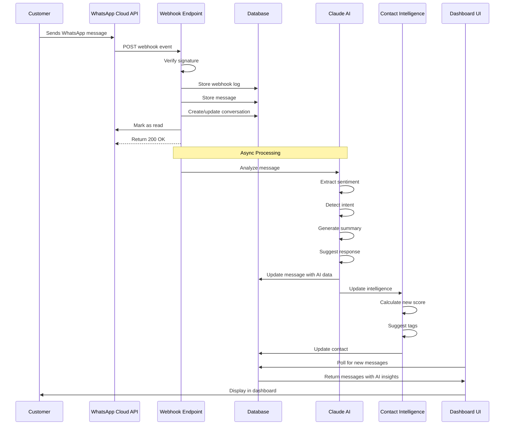
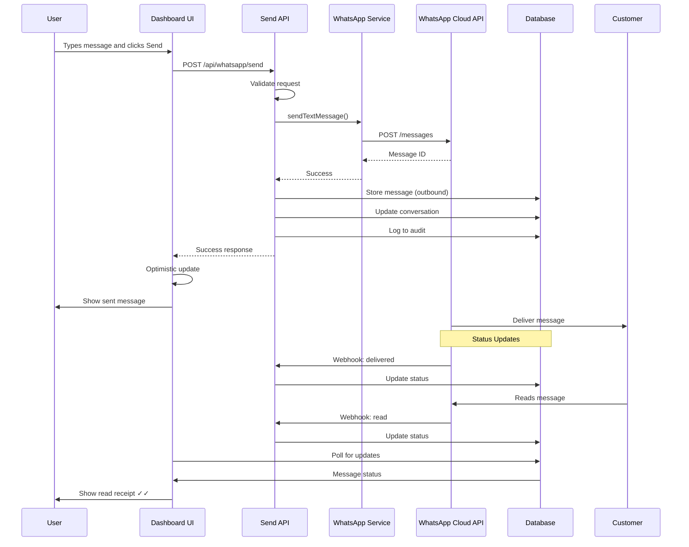
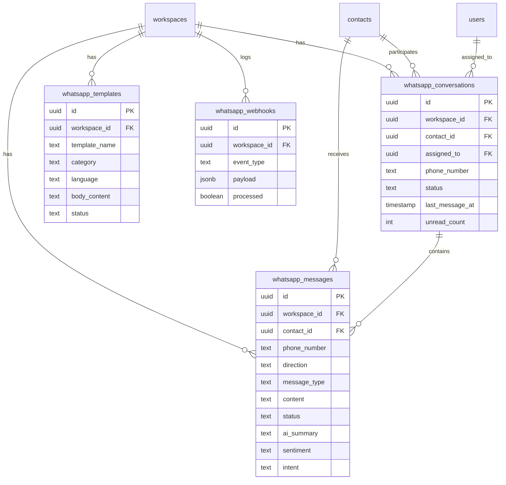
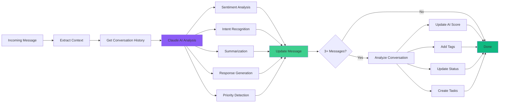
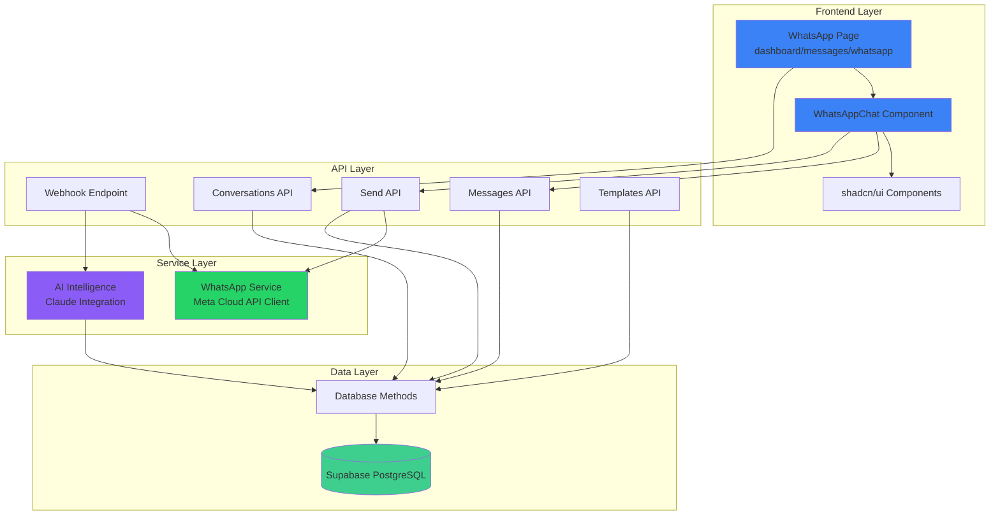
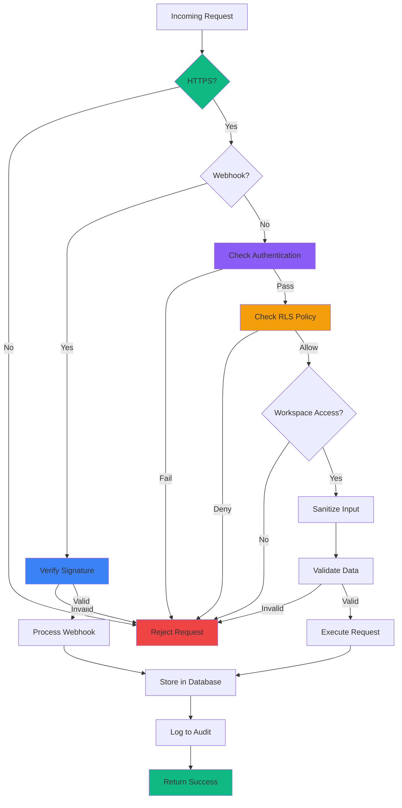
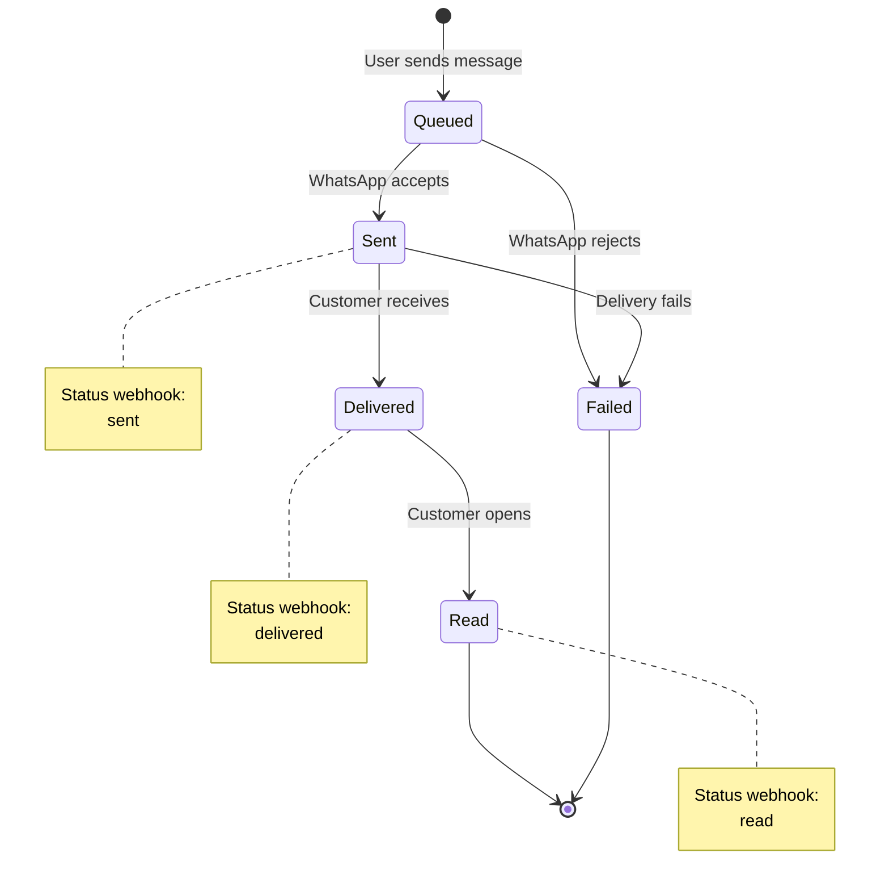
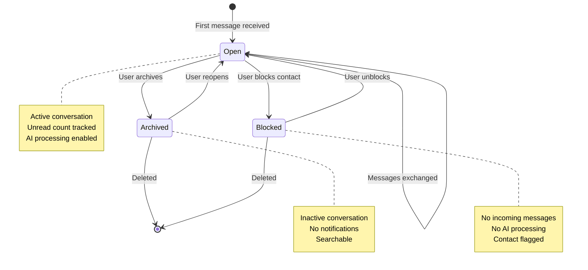
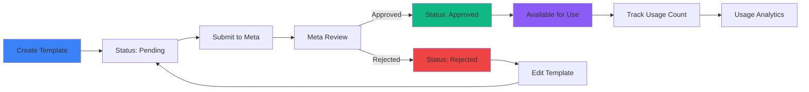
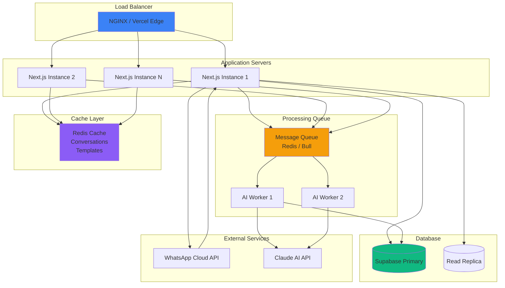

# WhatsApp Integration - System Architecture

Visual diagrams of the WhatsApp Business integration architecture.

## High-Level Architecture

```mermaid
graph TB
    User[Customer WhatsApp] -->|Sends Message| Meta[WhatsApp Cloud API]
    Meta -->|Webhook Event| Webhook[/api/webhooks/whatsapp]

    Webhook -->|Store| DB[(Supabase PostgreSQL)]
    Webhook -->|Trigger| AI[Claude AI Processing]

    AI -->|Analysis| DB
    AI -->|Update| Contacts[Contact Intelligence]

    Contacts -->|Update Score| DB
    Contacts -->|Add Tags| DB

    DB -->|Query| UI[WhatsApp Dashboard UI]
    UI -->|Display| UserBrowser[User Browser]

    UserBrowser -->|Send Reply| SendAPI[/api/whatsapp/send]
    SendAPI -->|Request| Meta
    SendAPI -->|Store| DB

    Meta -->|Deliver| User

    style Meta fill:#25D366
    style AI fill:#8B5CF6
    style DB fill:#3ECF8E
    style UI fill:#3B82F6
```

## Data Flow - Incoming Message



## Data Flow - Outgoing Message



## Database Schema Relationships



## AI Processing Pipeline



## Component Architecture



## Security Architecture



## Message State Machine



## Conversation Lifecycle



## Template Approval Flow



## Scalability Architecture



## Monitoring & Observability

```mermaid
graph TB
    subgraph "Application"
        App[WhatsApp Integration]
    end

    subgraph "Metrics"
        Metrics[Message Rate<br/>Response Time<br/>AI Processing Time<br/>Error Rate]
    end

    subgraph "Logs"
        Logs[Webhook Events<br/>AI Analysis<br/>Errors<br/>Audit Trail]
    end

    subgraph "Traces"
        Traces[Request Spans<br/>Database Queries<br/>External API Calls]
    end

    subgraph "Alerts"
        Alerts[Error Threshold<br/>Response Time SLA<br/>Queue Depth<br/>AI Failures]
    end

    App --> Metrics
    App --> Logs
    App --> Traces

    Metrics --> Alerts
    Logs --> Alerts
    Traces --> Alerts

    style App fill:#3B82F6
    style Metrics fill:#10B981
    style Logs fill:#F59E0B
    style Traces fill:#8B5CF6
    style Alerts fill:#EF4444
```

---

## Diagram Usage

These diagrams can be:
- Viewed in GitHub (auto-renders Mermaid)
- Exported to PNG/SVG using Mermaid Live Editor
- Included in presentations
- Used for onboarding new developers
- Updated as architecture evolves

## Tools

- **Mermaid Live Editor**: https://mermaid.live/
- **GitHub**: Native Mermaid support in markdown
- **VS Code**: Markdown Preview Mermaid extension
- **Export**: Use Mermaid CLI or online tools

---

**Last Updated**: 2025-11-15
