# Multi-Account Gmail Integration - Architecture

## System Architecture Diagram

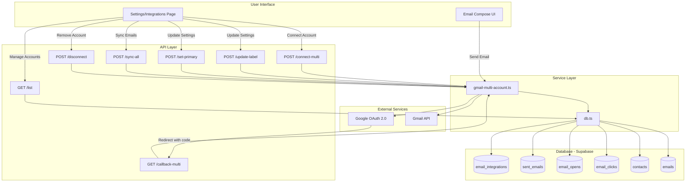

## Data Flow Diagrams

### OAuth Connection Flow

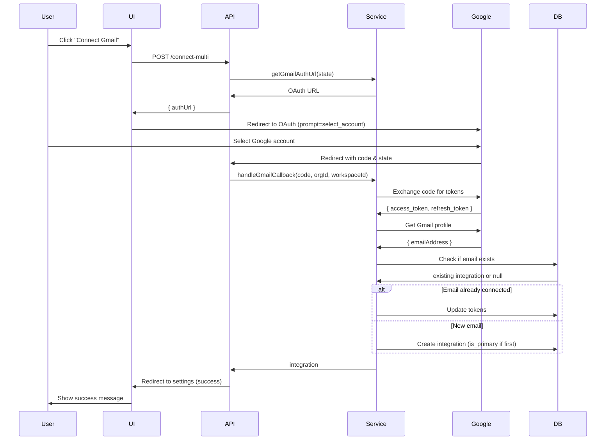

### Email Sync Flow

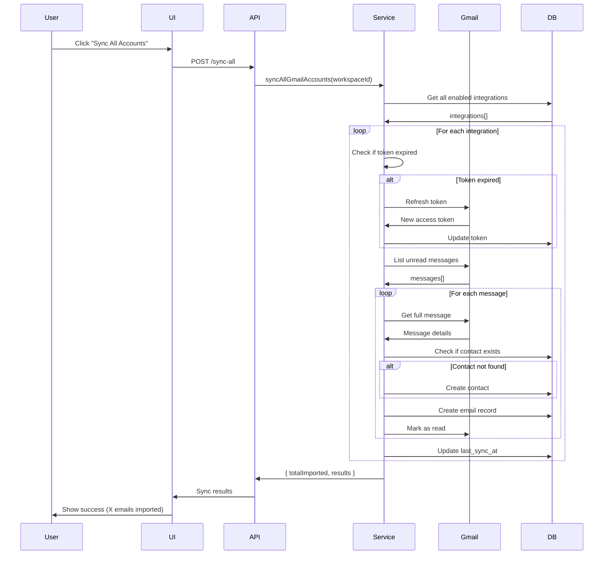

### Send Email Flow

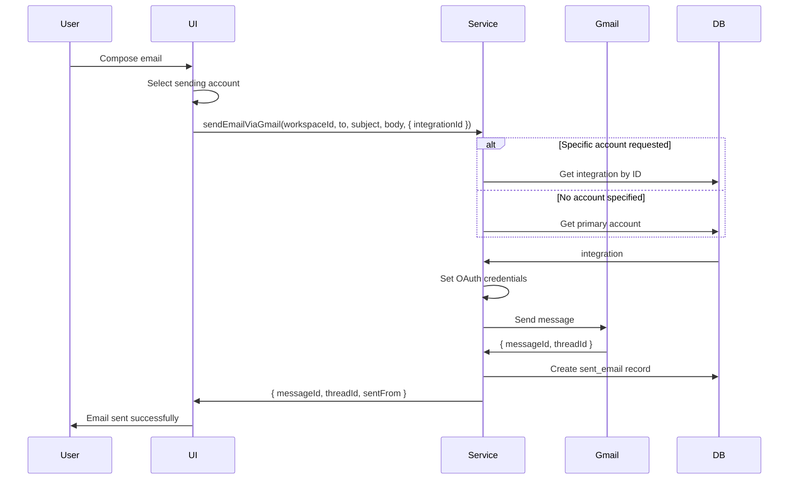

## Database Schema Diagram

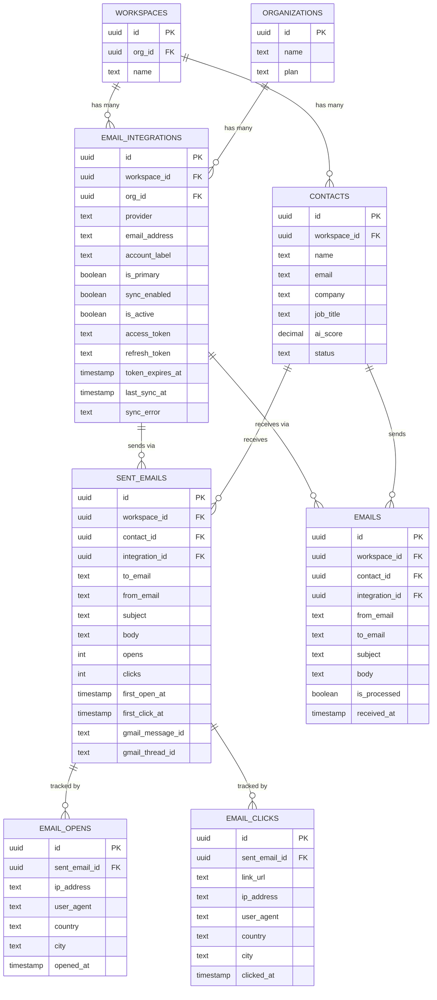

## Component Architecture

```mermaid
graph LR
    subgraph "Frontend Components"
        IntegrationsPage[IntegrationsPage.tsx]
        AccountCard[Account Card]
        EditDialog[Edit Label Dialog]
        SyncButton[Sync All Button]
        ConnectButton[Connect Button]
    end

    subgraph "State Management"
        IntegrationsState[integrations[]]
        LoadingState[loading]
        EditingState[editingLabel]
    end

    subgraph "UI Actions"
        LoadAction[loadIntegrations]
        ConnectAction[connectGmail]
        SyncAction[syncAllAccounts]
        LabelAction[updateLabel]
        PrimaryAction[setPrimary]
        ToggleAction[toggleSync]
        DisconnectAction[disconnectAccount]
    end

    IntegrationsPage --> AccountCard
    IntegrationsPage --> EditDialog
    IntegrationsPage --> SyncButton
    IntegrationsPage --> ConnectButton

    AccountCard --> IntegrationsState
    EditDialog --> EditingState

    ConnectButton --> ConnectAction
    SyncButton --> SyncAction
    AccountCard --> LabelAction
    AccountCard --> PrimaryAction
    AccountCard --> ToggleAction
    AccountCard --> DisconnectAction

    LoadAction --> IntegrationsState
    SyncAction --> LoadingState
```

## Security Architecture

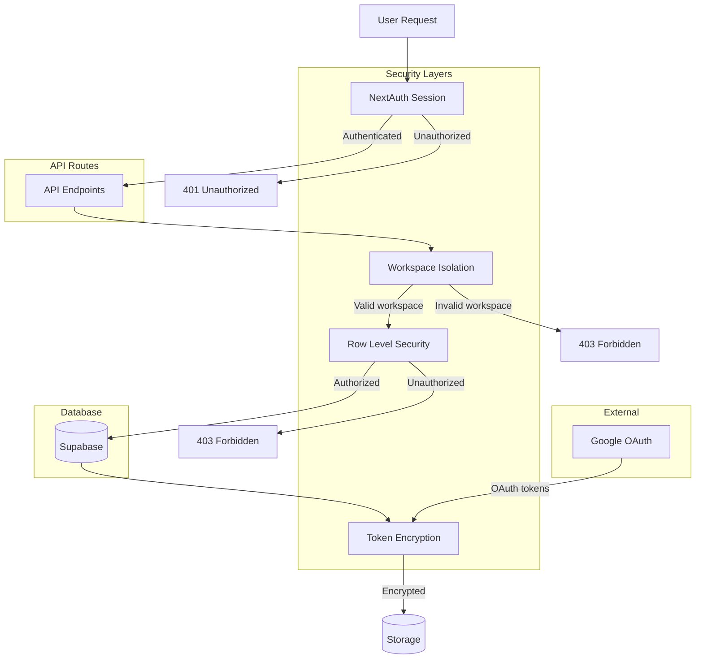

## State Management Flow

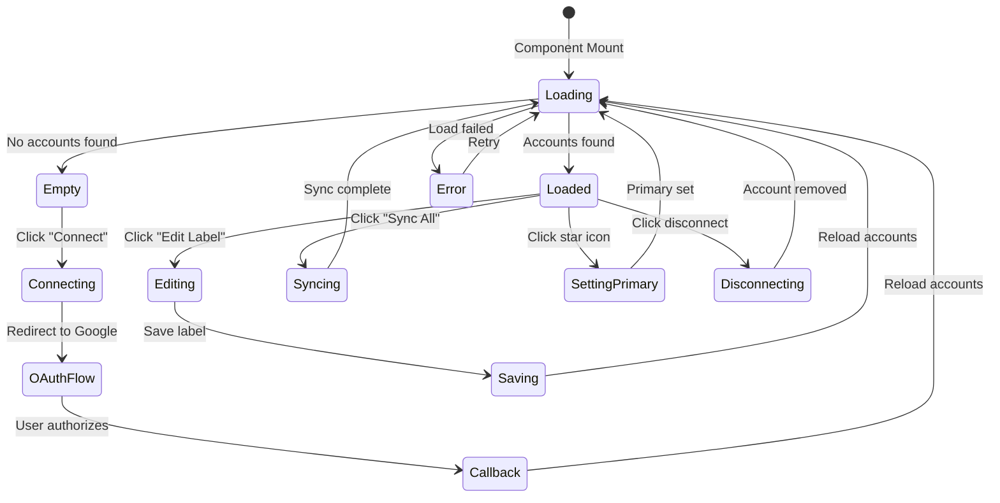

## Deployment Architecture

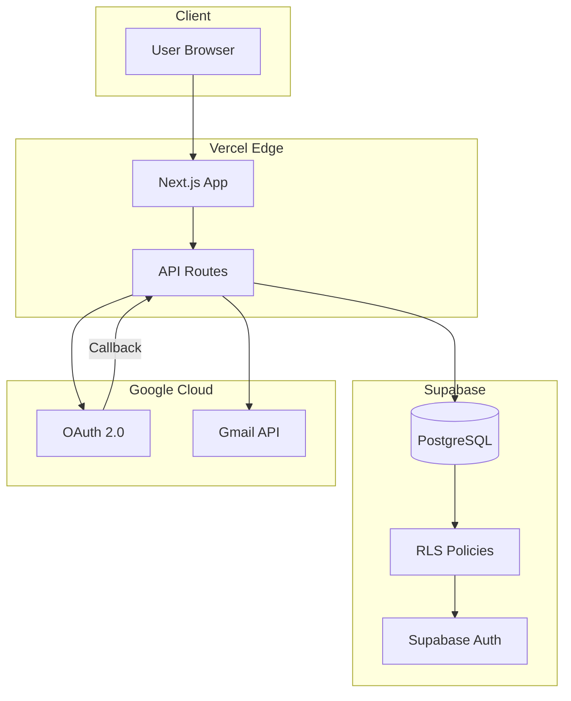

## Technology Stack

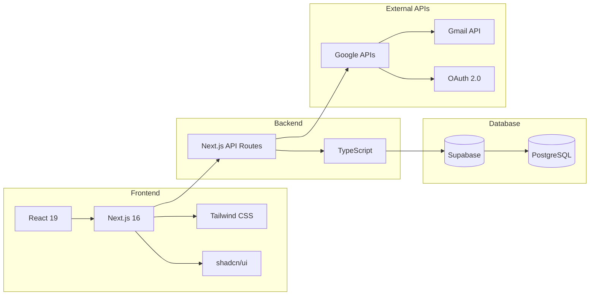

## Key Design Patterns

### 1. Repository Pattern
```typescript
// Database abstraction
db.emailIntegrations.getByWorkspace(workspaceId)
db.emailIntegrations.getPrimary(workspaceId)
db.sentEmails.create(data)
```

### 2. Service Layer Pattern
```typescript
// Business logic in service layer
await syncAllGmailAccounts(workspaceId)
await sendEmailViaGmail(workspaceId, to, subject, body)
```

### 3. Single Responsibility Principle
- **Database Layer:** Data access only
- **Service Layer:** Business logic only
- **API Layer:** HTTP handling only
- **UI Layer:** Presentation only

### 4. Dependency Injection
```typescript
// Service depends on abstractions
import { db } from "@/lib/db";
// Not on concrete implementations
```

### 5. Error Handling Pattern
```typescript
try {
  await operation();
  toast({ title: "Success" });
} catch (error) {
  console.error(error);
  toast({ title: "Error", variant: "destructive" });
}
```

## Scalability Considerations

### Horizontal Scaling
- Stateless API routes (scales on Vercel Edge)
- Database connection pooling (Supabase)
- No in-memory state

### Performance Optimization
- Database indexes on all foreign keys
- Lazy loading of account list
- Batch operations for multi-account sync
- Token refresh only when needed

### Rate Limiting
- Gmail API: 250 quota units/user/second
- Can sync ~50 emails/second/account
- Consider implementing queue for bulk operations

## Monitoring & Observability

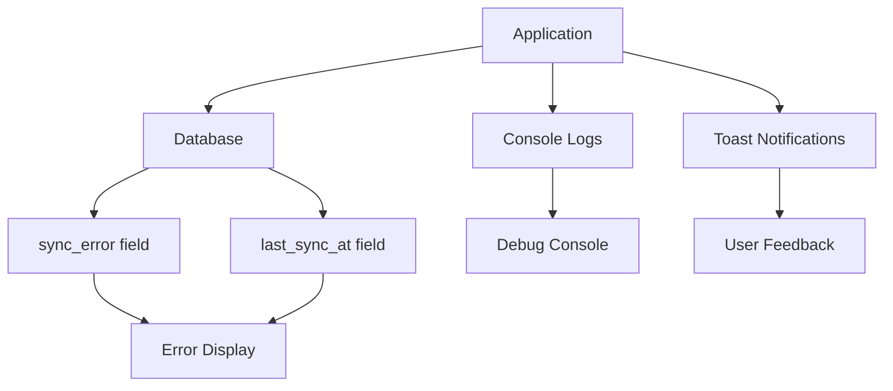

## Future Architecture Extensions

### Real-time Sync
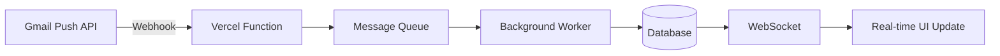

### Multi-Provider Support
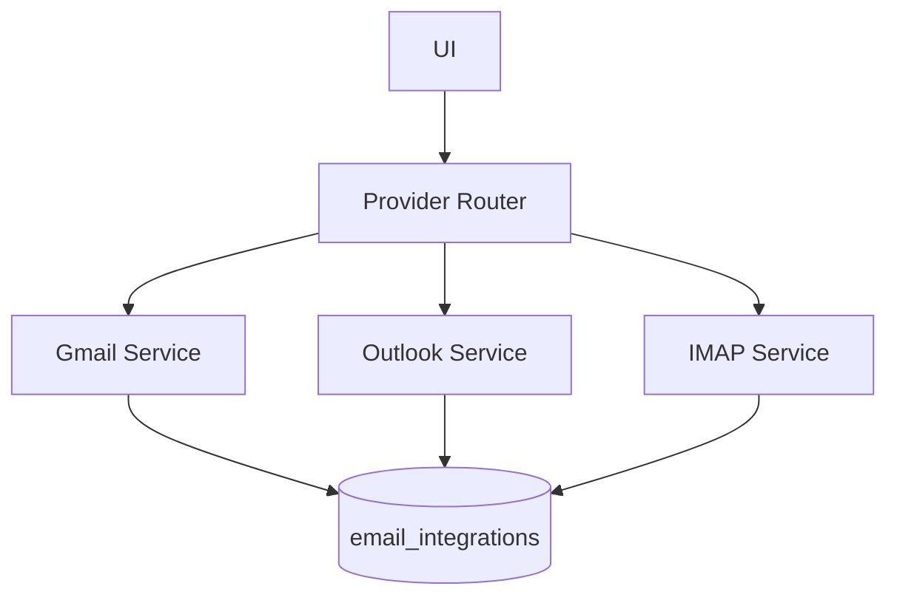

### Microservices (Future)
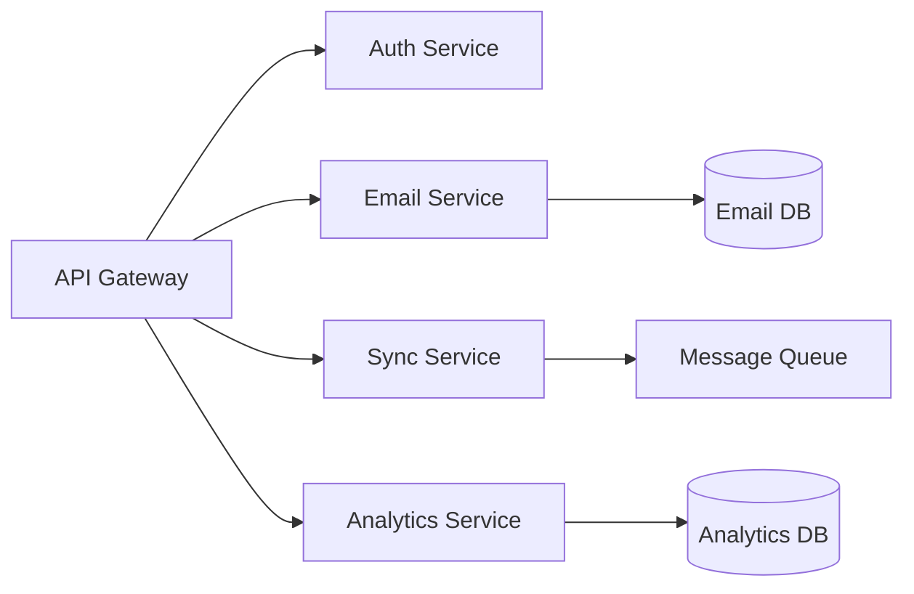

---

**Architecture Status:** Production-ready for MVP
**Last Updated:** 2025-11-15
**Version:** 1.0.0
